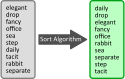

.. index:: computer science, algorithm

What is Computer Science?
-------------------------

With a little understanding of computers and programming, we can now turn our
attention to **computer science**, often abbreviated to **CS**.  Your first
thought might be, "Surely that is the study of computers!  We can study how
they work, how they are made, ..."

While that describes part of the field of computer science, it is a relatively
small part.  More broadly, CS is the study of **what we can do with
computers**.  Computer scientists use computers and programming to solve
problems, and they are constantly using them to solve new problems or finding
better solutions than those previously discovered.

These solutions are often in the form of programs or **algorithms**, high-level
descriptions of the steps a computer should follow, as opposed to the specific 
instructions given to the CPU.  For example, people have put a lot of work into
finding algorithms for rearranging values to be in a certain order, such as 
putting numbers into increasing order, words into alphabetical order, and so on.
These are known as `sorting algorithms <https://en.wikipedia.org/wiki/Sorting_algorithm>`_,
and people have developed a wide range of them.

   The input and output of a sorting algorithm.  Simple enough.  Now imagine
   needing to sort **millions** of words...

Why expend so much effort for solutions to such a simple problem?  Because
sorting is broadly applicable in a wide range of situations, and we have a
*lot* of data we want to sort.  As users of software, we very often want output
or results shown to us in sorted order, because it's easier for us to use that
way.  And software itself, other algorithms, benefit from having data sorted as
well.  Sorting turns out to be a very common step in the solutions of many
*other* problems.  Every time you search for something on the web, for example,
the search engine isn't scanning through everything on the internet each time;
instead, it's using a variety of pre-sorted lists to look things up quickly and
efficiently.

So sorting and the development of efficient algorithms for sorting is just one tiny,
tiny piece of computer science.  Wikipedia provides an `overview of the subfields of
`computer science<https://en.wikipedia.org/wiki/Computer_science#Areas_of_computer_science>`_.
It's a wide range, but it all fits within the questions: What can we *do* with
computers?  And how can we do those things efficiently?

And that is just the *science* or *research* part of computer science.  The
*application* of computer science is much broader still.  Again, the focus is
on *doing things* and *solving problems* with computers, and this has found its
way into just about every field imaginable.  Businesses are run with software
to manage data and automate processes; other sciences use computers to run
experiments and analyze data; artists are creating `algorithmic art
<https://en.wikipedia.org/wiki/Algorithmic_art>`_ and `interactive art pieces
<https://en.wikipedia.org/wiki/Interactive_art>`_; computers pervade the
creation and consumption of entertainment media; ...  the examples are
effectively endless.  In all of these cases, the key skill being applied is not
building the computer itself, but rather *programming* it and coming up with
the instructions it will follow to accomplish one's goal.

And so this is why this book focuses on teaching programming.  Knowing how to
program and how to solve problems with computers is a critical foundation for
computer science and data science.

.. admonition:: Check your understanding

   .. mchoice:: cyu_cs01
      :answer_a: ... who invented computers.
      :answer_b: ... what is inside a computer.
      :answer_c: ... telescopes.
      :answer_d: ... how to build computers.
      :answer_e: ... what computers can do.
      :correct: e
      :feedback_a: That is a relevant side interest, but it is not the focus of computer science.
      :feedback_b: That is a small piece of studying computer science, but it is not the focus of the field.
      :feedback_c: Nope!
      :feedback_d: This is well worth learning, but in computer science we *start* with a working computer and then think about how we can use it.
      :feedback_e: This is the main question of interest, and it is asked and answered in many ways.

      Which of the following best completes the sentence. (Many are true to very limited extents, but there is one that fits best by far.)

      "Computer science is the study of ..."
