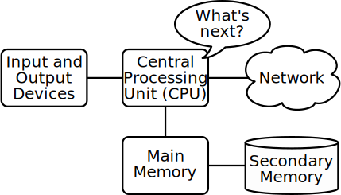
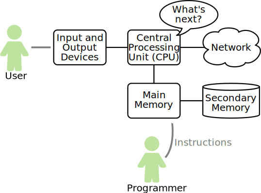

.. index:: computer, instructions

What is a Computer?
-------------------

*Computers* are clearly at the center of all of this, and so it is important
that we have a good idea of what a computer *is*.  You probably have a lot of
experience with computers, and so you probably have an idea of what a computer
is already.  What does it mean to you?

You might think about a device with a screen, possibly with a mouse and
keyboard to control it, or maybe a touchscreen if you're thinking about a
mobile device.  You might think about the software you use on the computer, the
applications that it runs.  You *might* even have some idea of what is inside
it; you might know terms like "CPU" and "RAM."

Desktop computers, laptops, and mobile devices are the most visible examples of
computers around us.  Not all computers have a screen, though.  There are
computers **embedded** in all kinds of things: cars have computers running
everything from their entertainment systems to their antilock brakes;
appliances like refrigerators and washing machines often include computers now;
some `lightbulbs <https://en.wikipedia.org/wiki/Philips_Hue>`_ even have
computers inside them; and the list just keeps getting longer.

If we distill down what really makes a computer a computer, we get a definition like this:

.. admonition:: Definition

   A **computer** is a *programmable* machine -- something that can execute a
   sequence of **instructions** in order to complete a task.

The critical feature of a computer is its ability to be **programmed**, to be given
a sequence of instructions it will follow.  And fundamentally, that's all computers
do; they follow instructions.

.. index:: hardware, CPU, main memory, secondary memory, input device, output device

Computer Hardware
^^^^^^^^^^^^^^^^^

Before we start learning the language we speak to give instructions to
computers to develop software, we need to learn a small amount about how
computers are built. If you were to take apart your computer or cell
phone and look deep inside, you would find the following physical parts,
referred to collectively as **hardware**:

   Hardware architecture.

The high-level definitions of these parts are as follows:

-  The **Central Processing Unit** (or CPU) is the part of the computer
   that executes instructions.  It is built to constantly ask "What's next?",
   asking for the next instruction to execute and then doing whatever that
   instruction says.  It can execute literally *billions* of instructions in a
   single second.

-  The **Main Memory** stores information that the CPU needs in a hurry.
   This includes the instructions that the CPU is always asking for as well as
   the data or information that the CPU operates on.  The main memory is nearly
   as fast as the CPU. But the information stored in the main memory vanishes
   when the computer is turned off.

-  The **Secondary Memory** also stores information, but it is
   much slower than the main memory. The advantage of the secondary
   memory is that it can store information even when there is no power
   to the computer. This is where data is stored long term. Examples of
   secondary memory are disk drives and flash memory (typically found in USB
   sticks and cell phones).

-  The **Input and Output Devices** are simply our screen, keyboard,
   mouse, microphone, speaker, touchpad, etc. They are all of the ways
   we interact with the computer.

-  These days, most computers also have a **Network Connection** to
   retrieve information over a network. One way we can think of the network
   is as a very slow place to store and retrieve data that might not always be
   available.

While most of the detail of how these components work is more than we need to
know here, it helps to have some terminology so we can talk about them as we
learn how to use them.

.. index:: user, programmer, program, code

What is Programming?
^^^^^^^^^^^^^^^^^^^^

You will find yourself interacting with the pieces of the hardware in two ways.
First, as a **user** of a computer, you interact with the input and output
devices.  As a program is running, you give it data via input devices and see,
hear, or otherwise perceive the results of the program via the output devices.

As a **programmer**, though, your job is to use and orchestrate each of these
resources to solve the problem that you need to solve and analyze the data you
get from the solution.  As a programmer you will be putting instructions for
the CPU into the computer's memory.  You will be **telling the computer what to
do**.

   Hardware architecture with users and programmers.

The CPU will execute whatever instructions you give it incredibly quickly, so
you will write down your instructions in advance. We call these stored
instructions a **program**, and the act of writing these instructions down and
getting the instructions to be correct is **programming**.

.. admonition:: Definition

   A **program** is a stored sequence of instructions for a computer.  We will
   also call this **code** and **software**.

   The process of writing a program is called **programming** or **coding**.

In the rest of this book, we will try to turn you into a person who is skilled
in the art of programming. In the end you will be a programmer -- perhaps not a
professional programmer, but at least you will have the skills to look at a
data/information analysis problem and develop a program to solve the problem.

.. index:: problem solving

In a sense, you need two skills to be a programmer:

-  First, you need to know the programming language (Python, in our case). 
   Knowing a language means you need to know the vocabulary and 
   the grammar. You need to be able to spell the words in this new language
   properly and know how to construct well-formed "sentences" in this new language.

-  Second, you need to "tell a story". In writing a story, you combine
   words and sentences to convey an idea to the reader. There is a skill
   and art in constructing the story, and skill in story writing is
   improved by doing some writing and getting some feedback. In
   programming, our program is the "story" and the problem you are
   trying to solve is the "idea".

Once you learn one programming language such as Python, you will find it
much easier to learn a second programming language such as JavaScript or
C++. The new programming language has very different vocabulary and
grammar, but the problem-solving skills will be the same across all
programming languages.

You will learn the "vocabulary" and "sentences" of Python pretty
quickly. It will take longer for you to be able to write a coherent
program to solve a brand-new problem. We teach programming much like we
teach writing. We start reading and explaining programs, then we write
simple programs, and then we write increasingly complex programs over
time. At some point you "get your muse" and see the patterns on your own
and can see more naturally how to take a problem and write a program
that solves that problem. And once you get to that point, programming
becomes a very rewarding and creative process.

Computers are very powerful, but they are also very dumb.  It's important
to remember the following:

.. admonition:: Remember

   When programming computers, they will always do precisely what you tell them
   to do -- no less and no more.  They won't make a guess about what you mean,
   and they won't stop if you ask them to do something you didn't mean to.
   They will blindly follow the instructions you give them.

You can think of programming like giving commands to a dog.  When we train a
dog, we use special words like "sit", "stay", and "fetch". When you talk to a
dog and don’t use any of the words they know, they just look at you with a
quizzical look on their face until you say one they recognize. For example, if
you say, "I wish more people would walk to improve their overall health", what
most dogs likely hear is, "blah blah blah *walk* blah blah blah blah." That is
because "walk" is part of that dog's language.

So let's give our first command to Python in a language it can understand.
For this we will focus on the Python equivalent of "speak" (in human-to-dog
language), which is "print". 

In the code below, replace the text between the quotation marks with anything 
you would like Python to say. If this is your first program it is customary to
use "Hello, world!", but if that's not cool with you we understand. 

Once you have replaced the text just click on the "Run" button to the right.
Python will then do exactly what you told it to do.

.. activecode:: programming01

   print("Replace this text")

And now you have written your first valid Python program!  

You have also seen your first *function*  and *string* (more on those later). We used 
the function ``print()`` along with a string of text enclosed in quotes.  

