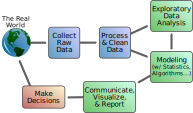

.. index:: data science

What is Data Science?
---------------------

With an understanding of computers and computer science, it's time to turn our
attention to the last part of the book title, Data Science.  It can be
understood as an *application* of computers and computer science.

.. admonition:: Definition

   **Data Science** is a field that focuses on the specific problems of
   acquiring, curating, and exploring data, via visualization and statistical
   analysis, to aid decision making.

   Data science as a process.

All data is initially collected in some way from the real world.  Acquiring
data typically involves either accessing existing data sets that someone else
has collected or creating new data sets yourself.  Accessing data might involve
retrieving data from different kinds of data repositories that have been
developed by companies, government agencies, or academic researchers. As more
and more data is being collected by these groups, more and more is being made
publicly accessible. As just one example, take a look at `Data.gov
<https://www.data.gov/>`_, the U.S. government's online repository of open data
sets.

You can create your own data sets by recording data yourself or gathering it
from other digital resources.  Collecting your own data might involve placing
sensors to monitor environmental conditions over time or regularly logging
quantifiable information about your day via an app.  If gathering data from
digital sources, data science provides many tools that can automate collection
from information sources on the internet. For example, we could generate a data
set about jobs in a particular area by collecting information from job posting
websites.  

Curating data typically involves cleaning and organizing data sets in
preparation for analysis and visualization. Real-world data sets are often
*messy*, with missing data, erroneous information, and duplicate entries. Data
science provides methods and tools for finding and correcting these problems.
If data is being integrated from multiple separate datasets, data science also
provides ways to properly merge different sources of data.  

The large data sets we might collect are difficult for people to understand in
their raw form.  Visualizations and statistics are two tools that help us
understand large data sets. Visualizations refer to graphical representations
of data, like charts or figures. Statistics are formal mathematical tools for
helping us describe and make inferences from large sets of data. Data science
provides tools that allow for the automation of the creation of visualizations
and statistics.   

Data scientists typically apply programming along with mathematics and applied
statistics to problems within a specific domain area (for example, finance or
meterology). Knowing how and when to use data science tools requires expertise
in the domain area where the tools are being used. 

It is important to remember that data science tools only provide useful
insights if the right data and the right tools are being used to solve the
problem. It is easy to produce results that look important or insightful but
might actually be misleading.  

What Skills Do I Need to Do Data Science?
^^^^^^^^^^^^^^^^^^^^^^^^^^^^^^^^^^^^^^^^^

You will need to know **programming**, you will need to know **statistics**,
and you will need to know about your **domain area**. (As we've mentioned, this
book will focus on the fundamentals of the first of those: programming.) Data
scientists do differ quite a bit in how much they know about or use knoweldge
in these three areas. Some are stronger in programming and statistics but not
domain knowledge, others may be strong in programming and domain knowledge but
might not know about or need much statistics. However, one thing that
differentiates a data scientist from a traditional programmer, a traditional
statistician, and a traditional business analyst is the degree to which the
data scientist can use tools from each of these areas to solve problems. 

Another common skill that is required for data scientists is **communication**.
Great insights and great solutions to problems are only really great if you can
convince other people that they are correct. Conveying technical information
about to an audience that does not share your technical expertise can be a
great challenge. 
