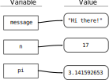

.. index:: variable

Variables
---------

One of the most basic but important features of a programming language is the
ability to store a value to be used later.  We do this by assigning the value
to a particular name, and then referring to the value using that name in a
later line of code.  These names with assigned values are called **variables**.

.. admonition:: Definition

   A variable is a name that is used to represent a value that can change when
   a program is run.

.. index:: assignment
.. index::
   single: variable; assignment

Variable Assignment
^^^^^^^^^^^^^^^^^^^

**Assignment statements** both create new variables and give them values:

.. activecode:: variable_assignment_example

   message = "Hi there!"
   n = 17
   pi = 3.141592653

This example makes three assignments. The first assigns the string value ``"Hi
there!"`` to a new variable named ``message``; the second assigns the integer
``17`` to ``n``; and the third assigns the (approximate) value of :math:`\pi`
to ``pi`` as a floating point number.

Notice that if you run this code, nothing is output.  Assigning variables does
not print their values or produce any other output.

.. _assignment-statement:

.. admonition:: Syntax Pattern

   Assignment statements have the form:

   ::

      <variable> = <expression>

   Python interprets this in two steps:
   
   1. Evaluate the expression on the **right**.
   2. Assign the resulting value to the variable on the **left**.
 
   **Assignment always "goes from right to left."**

So what happens if you get it backwards?  Try running this:

.. activecode:: variables01

   17 = n

.. _assignment-is-not-equality:

.. tip::

   **Assignment is not equality.**

   Though assignment uses the ``=`` sign, do not think of it as "equals."
   Writing ``n = 17`` does *not* mean "n equals 17," at least not forever.
   Remember that ``n`` is a *variable*, and so it can change.
 
   The statement ``n = 17`` means, and you should read it as, "n is assigned
   the value 17" or "n gets 17."  
   
   This also explains why ``17 = n`` is invalid: "17 gets n" doesn't make sense.

It can be very useful to *visualize* how programs work to understand them better.
When visualizing variable assignments, it is common to
think of them as connections or arrows leading *from* a variable's name *to*
the value that it references.  The figure below illustrates this for the three
variables in the example code above.

   A visual representation of variables referencing values.

You can see a similar visual representation of variables and their values in
any of the code in this book by using the "CodeLens" view in any Active Code
block.  Try it with :ref:`the block of example code
above<variable_assignment_example>`.

To output the value of a variable, you can use a print statement.  (If you are
working in a notebook or an interpreter, you can simply type the variable name 
as the last line of a cell to display its value. )

.. activecode:: variables02

   message = "Hi there!"
   n = 17
   pi = 3.141592653

   print(message)
   print(n)
   print(pi)

.. .. index:: statement
.. 
.. .. admonition:: Definition
.. 
..    A **statement** is a unit of code that the Python interpreter can execute.
..    We have seen two kinds of statements so far: print statements and assignment
..    statements.  Programs are made up of sequences of statements that are
..    executed one at a time.

.. index::
   single: variable; types

Variables have types, just like values do.  The type of a variable is the type
of the value it refers to.

.. activecode:: variables03

   message = "Hi there!"
   n = 17
   pi = 3.141592653

   print(type(message))
   print(type(n))
   print(type(pi))

.. admonition:: Check your understanding

   .. fillintheblank:: cyu_vars01

      After running this code:

      ::

         var1 = 1
         var2 = '2'

      The type of ``var1`` will be |blank|.

      The type of ``var2`` will be |blank|.

      -   :int: Correct.
          :<class 'int'>: That's technically right, but we usually just say or write ``int``.
          :x: Incorrect.  Re-read above about variable types.
      -   :str: Correct.
          :<class 'str'>: That's technically right, but we usually just say or write ``str``.
          :x: Incorrect.  Re-read above about variable types.

   .. activecode:: cyu_vars02

      Make two variables, one named ``x`` and one named ``word``.
      
      And assign ``x`` the value ``123`` and assign ``word`` the value
      ``"horse"``.
      ~~~~
      ====
      from unittest.gui import TestCaseGui

      class myTests(TestCaseGui):

          def testOne(self):
              self.assertIsInstance(x, int, "x should be an integer.")
              self.assertEqual(x, 123, "x should be assigned 123.")
              self.assertIsInstance(word, str, "word should be a string.")
              self.assertEqual(word, 'horse', "word should be assigned \"horse\".")

      myTests().main()

.. index:: keyword, underscore character
   single: variable; naming

Variable Names and Keywords
^^^^^^^^^^^^^^^^^^^^^^^^^^^

Programmers should choose names for variables that are meaningful and
help others understand what the variable is used for in the program.

Python has syntax rules about valid variable names.  If you don't follow these
rules, you will either get a syntax error *or* a semantic error: you might
create something that is valid syntax but doesn't at all mean what you think it
does.

.. admonition:: Syntax Rule

    Variable names **must**:

    - Be made of letters, digits, and underscore characters ``_``.

    - Always begin with a letter or an underscore (not a digit).

    - Never contain spaces.

    Case matters.  ``Count`` and ``count`` are different variables.
 
Although it is legal to use uppercase letters, by convention we don't.  Capitalized
names are generally used for classes, which we'll see later.  If we follow this
convention, then we can easily see whether a name is a variable or a class just based
on whether or not it is capitalized.

The underscore character ``_`` is often used in names with multiple words,
such as ``my_name`` or ``airspeed_of_unladen_swallow``.  Variable names can
start with an underscore character, but we generally avoid doing this unless we
are writing library code for others to use.

If you give a variable an illegal name, you will get a syntax error.  In this code,
each of the variable names is illegal.

::

    76trombones = "big parade"
    more$ = 1000000
    class = "Computer Science 101"

``76trombones`` is illegal because it does not begin with a letter.
``more$`` is illegal because it contains an illegal character, the dollar sign.
But what's wrong with ``class``?

It turns out that ``class`` is one of Python’s **keywords**.  Keywords are part
of the language's formal definition, and they cannot be used as variable names.

Python reserves 33 keywords:

.. import keyword
.. for i in range(7):
..     print("\t".join([keyword.kwlist[x] for x in range(i,len(keyword.kwlist),7)]))
.. code-block:: none

    False    class      finally   is         return
    None     continue   for       lambda     try
    True     def        from      nonlocal   while
    and      del        global    not        with
    as       elif       if        or         yield
    assert   else       import    pass
    break    except     in        raise

You might want to keep this list handy. If the interpreter complains about one
of your variable names and you don’t know why, see if it is on this list.

.. _variable-naming:

Choosing Good Variable Names
^^^^^^^^^^^^^^^^^^^^^^^^^^^^

As long as you follow the simple rules of variable naming and avoid
keywords, you have a lot of choice when you name your variables.  In the
beginning, this choice can be confusing both when you read a program and when
you write your own programs. For example, the following three programs are
identical in terms of what they accomplish, but very different when you read
them and try to understand them.

.. code:: python

   a = 35.0
   b = 12.50
   c = a * b
   print(c)

.. code:: python

   hours = 35.0
   rate = 12.50
   pay = hours * rate
   print(pay)

.. code:: python

   x1q3z9ahd = 35.0
   x1q3z9afd = 12.50
   x1q3p9afd = x1q3z9ahd * x1q3z9afd
   print(x1q3p9afd)

The Python interpreter sees all three of these programs as *exactly the same*
but humans see and understand these programs quite differently.  Humans will
most quickly understand the *intent* of the second program because the
programmer has chosen variable names that reflect their intent regarding what
data will be stored in each variable.

.. tip::

   Choose names for your variables that will be descriptive and meaningful to
   you and anyone else reading your code.  Generally, they should describe or
   relate to the information held by that variable.  Doing this consistently
   will help you and others understand your code and what each variable is used
   for.

We call these wisely chosen variable names "mnemonic variable names."  The word
*mnemonic* means "memory aid". We choose mnemonic variable names to help us
remember why we created the variable in the first place.

While this all sounds great, and it is a very good idea to use mnemonic
variable names, mnemonic variable names can get in the way of a beginning
programmer’s ability to parse and understand code. This is because beginning
programmers have not yet memorized the keywords (there are only 33 of them) and
sometimes variables with names that are too descriptive start to look like part
of the language and not just well-chosen variable names.

Take a quick look at the following Python sample code which loops through some
data. We will cover loops soon, but for now try to just puzzle through what
this means:

.. code:: python

   for word in words:
       print(word)

What is happening here? Which of the tokens (``for``, ``word``, ``in``, etc.) are
keywords and which are just variable names? Does Python understand at a
fundamental level the notion of words? Beginning programmers have trouble
separating what parts of the code *must* be the same as this example and what
parts of the code are simply choices made by the programmer.

After a pretty short period of time, you will know the most common keywords,
and you will start to see the keywords jumping out at you:

.. raw:: html

   <pre>
   <b style="color: red;">for</b> word <b style="color: red;">in</b> words<b style="color: red;">:</b>
       <b style="color: red;">print</b>(word)
   </pre>

The parts of the code that are defined by Python (``for``, ``in``, ``print``,
and ``:``) are in bold, and the programmer-chosen variables (``word`` and
``words``) are not in bold. Many text editors are aware of Python syntax and
will "highlight" it, coloring keywords differently to give you clues to keep
your variables and keywords separate. You'll notice all of the code in this
book is highlighted as well. After a while you will begin to read Python and
quickly determine what is a variable and what is a keyword.
