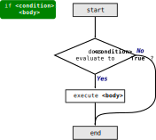
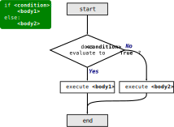
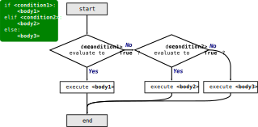

.. index:: conditional;statement, if statement

Conditionals
------------

In order to write useful programs, we almost always need the ability to have
the program take *different* actions based on *conditions* that are checked
when it is running.  That is, do one thing *if* something is true, or do
another thing *if* it is not true.  **Conditional statements** give us this
ability. The simplest form is the ``if`` statement, which has shown up a few times in examples already:

.. code:: python

   if x > 0:
       print("x is positive.")

This can be read aloud as: "*If* x is greater than zero, *then* print 'x is
positive.'"

.. index:: condition

The expression after the ``if`` statement is called the **condition**; here it
is ``x > 0``. We end the ``if`` statement with a colon ``:`` and the line(s)
after the ``if`` statement, the body of the conditional, are indented.

.. admonition:: Syntax Pattern

   A basic ``if`` statement has the form:

   ::

      if <condition>:
          <body>

   Python interprets this as follows:

   1. It evaluates the expression in ``<condition>``.
   2. *If* the condition evaluates to ``True``, then it executes the statements in ``<body>``.
   3. Otherwise (if the condition is ``False``), then the body is skipped.

   Flowchart illustrating the execution of a basic if statement.

.. index:: compound statement

Notice the consistency in the Python syntax here:  ``if`` statements have the
same basic structure as :ref:`for loops <for-loop-syntax>`. The statement
consists of a header line that ends with the colon ``:`` followed by an
indented block of statements that make up its body. Statements like this are
called **compound statements** because they stretch across more than one line.

.. index:: pass statement

There is no limit on the number of statements that can appear in the body, but
there must be at least one. Occasionally, it is useful to have a body with no
statements (usually as a place holder for code you haven’t written yet). In
that case, you can use the ``pass`` statement, which does nothing.

.. code:: python

   if x < 0:
       pass    # this doesn't do anything (yet)

.. index:: alternative execution, if-else statement, else statement

Alternative execution
^^^^^^^^^^^^^^^^^^^^^

A second form of the ``if`` statement is **alternative execution** or **if-else
statement**, in which there are two possibilities and the condition determines
which one gets executed. The syntax looks like this:

.. activecode:: conditionals01

   x = int(input("Please enter an integer: "))

   if x % 2 == 0:
       print(x, "is even.")
   else :
       print(x, "is odd.")

If the remainder when ``x`` is divided by 2 is 0, then we know that ``x`` is
even, and the program displays a message to that effect. If the condition is
false, the indented block after the ``else`` line is executed.

.. admonition:: Syntax Pattern

   An ``if-else`` statement has the form:

   ::

      if <condition>:
          <body1>
      else:
          <body2>

   Python interprets this as follows:

   1. It evaluates the expression in ``<condition>``.
   2. *If* the condition evaluates to ``True``, then it executes the statements in ``<body1>``.
   3. Otherwise (if the condition is ``False``), then it executes the statements in ``<body2>``.

   Flowchart illustrating the execution of an if-else statement.

.. index:: branch

Since the condition must either be true or false, exactly one of the
alternatives will be executed. The alternatives are called *branches*, because
they are branches in the flow of execution.

.. index:: chained conditional, conditional;chained

Chained conditionals
^^^^^^^^^^^^^^^^^^^^

Sometimes there are more than two possibilities and we need more than two
branches. One way to express a computation like that is a **chained
conditional**:

.. activecode:: conditionals02

   x = int(input("Please enter an integer: "))
   y = int(input("Please enter another integer: "))

   if x < y:
       print(x, 'is less than', y)
   elif x > y:
       print(x, 'is greater than', y)
   else:
       print(x, 'and', y, 'are equal')

.. index:: elif statement

``elif`` is an abbreviation of "else if." Again, exactly one branch will be
executed.  There is no limit on the number of ``elif`` statements. If there is
an ``else`` clause, it has to be at the end, but there doesn’t have to be one.

.. code:: python

   if choice == 'a':
       print('Bad guess')
   elif choice == 'b':
       print('Good guess')
   elif choice == 'c':
       print('Close, but not correct')

Each condition is checked in order. If the first is false, the next is
checked, and so on. If one of them is true, the corresponding branch
executes, and the statement ends.

.. note::

   Even if more than one condition is true, only the first true branch executes.

.. admonition:: Syntax Pattern

   A general conditional statement has the form:

   ::

      if <condition1>:
          <body1>
      # There can be one or more elif sections (optional)
      elif <condition2>:
          <body2>
      # There can be one else section at the end (optional)
      else:
          <body3>

   Python interprets this as follows:

   1. It evaluates the condition expression in the ``if`` statement.
   2. *If* the condition evaluates to ``True``, then it executes the statements in ``<body1>`` and leaves the conditional (skipping all ``elif`` and ``else`` sections).
   3. Otherwise (if the condition is ``False``), then it evaluates the expression in the next ``elif`` statement.
   4. *If* that condition evaluates to ``True``, then it executes the statements in ``<body2>`` and leaves the conditional (skipping all ``elif`` and ``else`` sections).
   5. Steps 3 and 4 are repeated for each ``elif`` statement.
   6. If no condition matches and an ``else`` statement is present, it executes the statements in the ``else`` block.

   Flowchart illustrating the execution of general conditional statement.

.. index:: nested blocks

Nested Blocks
^^^^^^^^^^^^^

Notice how any time we've introduced a syntax pattern with an indented
``<body>``, we've talked about it as being made up of *statements*?  It's
important to understand that the statements inside the body of a for loop or
conditional (or any other indented body) can be *any* valid Python statements,
including for loops or conditionals themselves!

So for example, one conditional can be nested within another, and we could have
written the three-branch example like this:

.. code:: python

   if x < y:
       print(x, 'is less than', y)
   else:
       if x > y:
           print(x, 'is greater than', y)
       else:
           print(x, 'and', y, 'are equal')

The *outer* conditional contains two branches. The first branch contains a
simple print statement. The second branch contains another ``if`` statement,
which has two branches of its own. Those two branches are both simple
statements, although they could have been conditional statements as well.

Although the indentation of the statements makes the structure apparent,
*nested conditionals* become difficult to read very quickly. In general, it is
a good idea to *avoid* them if you can.  But don't be afraid to put a for loop
inside a conditional, or a conditional inside a for loop.  It's perfectly valid
and quite common.  You can see an example in the :ref:`example program <wordcount_example>` in the Introduction.
