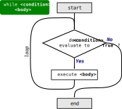
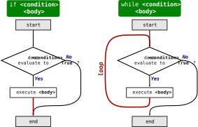

.. index:: while loop, loop;while

While Loops
-----------

Our next control structure is the **while loop**.  Like a for loop, the while loop can repeatedly execute a sequence of instructions, but instead of repeating a set number of times based on a sequence of values, the while loop repeats *as long as some condition is True*.

Here is a simple program that counts down from five and then says "Blastoff!".

.. activecode:: while01

   n = 5
   while n > 0:
       print(n)
       n = n - 1
   print('Blastoff!')

You can almost read the ``while`` statement as if it were English. This reads,
"While ``n`` is greater than 0, display the value of ``n`` and then reduce the
value of ``n`` by 1. When you get to 0, exit the ``while`` loop and display the
word ``Blastoff!``"

.. index:: flow of execution

More formally, here is the flow of execution for a ``while`` statement:

.. _while-loop-syntax:

.. admonition:: Syntax Pattern

   While loops have the form:

   ::

      while <condition>:
          <body>

   Python interprets this as follows:

   1. Evaluate ``<condition>``, producing either True or False.
   2. If the condition is False, exit the ``while`` loop and continue execution below.
   3. If the condition is True, execute the statements in ``<body>``, then return to step 1.

   Flowchart illustrating the execution of a while loop.

It's worth noting here that while loops are *very* similar to conditionals.
This is made clear if we place the flowcharts side by side:

   Visual comparison of conditional and while loop structure.

Here, we have highlighted the one difference in red.  The only difference
between the two structures is in what happens after the execution of the body.
The if statement continues to the instructions below, but the while loop
returns back to check the condition again.  This small structural difference
results in very different behavior, but it can help you reason about the two
structures and understand them similarly.

.. index:: infinite loop

Infinite Loops
^^^^^^^^^^^^^^

The body of the loop should change the value of one or more variables so that
eventually the condition becomes false and the loop *terminates*.  If nothing
changes to make the condition become false, then the loop will repeat
*forever*, a situation we call an **infinite loop**.

An endless source of amusement for programmers is the observation that the
directions on shampoo, "Lather, rinse, repeat," are an infinite loop because
there is no changing condition that would ever stop you from repeating the
loop.

In the case of the ``countdown`` code above, we can prove that the loop
terminates because we know that the value of ``n`` is finite, and we can see
that the value of ``n`` gets smaller each time through the loop, so eventually
we have to get to 0.

Other times a loop might be obviously infinite.  The following examplesof
infinite loops are *not* ActiveCode, because running them might crash your
browser!

.. code:: python

   while True:
       print("Nothing can stop me!")
 
.. code:: python

   x = 4
   while x > 0:
       print("x is still positive...")

.. note::

   In most programming environments, you will be able to stop a program if it
   gets stuck in an infinite loop.  In some cases, like running your code in an
   *integrated development environment*, there will be a "stop" button of some
   sort.  Or if you are running your program on the command line, pressing
   :kbd:`Ctrl` and :kbd:`C` together (often written as :kbd:`Ctrl+C`) can ends
   its execution.

   In the browser, though, the ActiveCode environment doesn't provide an easy
   way to terminate a program stuck in an infinite loop, so try to avoid
   writing any while practicing here!
