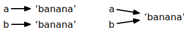

.. role:: raw-latex(raw)
   :format: latex
..

Lists
=====

.. index:: list, type;list

A list is a sequence
--------------------

Like a string, a *list* is a sequence of values. In a string, the values
are characters; in a list, they can be any type. The values in list are
called *elements* or sometimes *items*.

.. index:: element, sequence

.. index:: item

There are several ways to create a new list; the simplest is to enclose
the elements in square brackets ("[" and "]"):

.. code:: python

   [10, 20, 30, 40]
   ['crunchy frog', 'ram bladder', 'lark vomit']

The first example is a list of four integers. The second is a list of
three strings. The elements of a list don’t have to be the same type.
The following list contains a string, a float, an integer, and (lo!)
another list:

.. code:: python

   ['spam', 2.0, 5, [10, 20]]

A list within another list is *nested*.

.. index:: nested list, list;nested

A list that contains no elements is called an empty list; you can create
one with empty brackets, ``[]``.

.. index:: empty list, list;empty

As you might expect, you can assign list values to variables:

.. activecode:: lists01

   cheeses = ['Cheddar', 'Edam', 'Gouda']
   numbers = [17, 123]
   empty = []
   print(cheeses, numbers, empty)
   

.. index:: assignment

Lists are mutable
-----------------

.. index:: list;element, access

.. index:: index, 

.. index:: bracket operator

.. index:: operator;bracket

The syntax for accessing the elements of a list is the same as for
accessing the characters of a string: the bracket operator. The
expression inside the brackets specifies the index. Remember that the
indices start at 0:

.. activecode:: lists01b

   cheeses = ['Cheddar', 'Edam', 'Gouda']
   print(cheeses[0])
   

Unlike strings, lists are mutable because you can change the order of
items in a list or reassign an item in a list. When the bracket operator
appears on the left side of an assignment, it identifies the element of
the list that will be assigned.

.. index:: mutability

.. activecode:: lists02

   numbers = [17, 123]
   numbers[1] = 5
   print(numbers)
   

The one-th element of ``numbers``, which used to be 123, is now 5.

.. index:: index;starting at zero

.. index:: zero, index starting at

You can think of a list as a relationship between indices and elements.
This relationship is called a *mapping*; each index "maps to" one of the
elements.

.. index:: item assignment

.. index:: assignment;item

List indices work the same way as string indices:

-  Any integer expression can be used as an index.

-  If you try to read or write an element that does not exist, you get
   an ``IndexError``.

.. index:: exception;IndexError

.. index:: IndexError

-  If an index has a negative value, it counts backward from the end of
   the list.

.. index:: list;index, list;membership

.. index:: membership;list, in operator

.. index:: operator;in

The ``in`` operator also works on lists.

.. activecode:: lists02b

   cheeses = ['Cheddar', 'Edam', 'Gouda']
   print('Edam' in cheeses)
   print('Brie' in cheeses)
   

Traversing a list
-----------------

.. index:: list;traversal, traversal;list

.. index:: for loop, loop;for

.. index:: statement;for

The most common way to traverse the elements of a list is with a ``for``
loop. The syntax is the same as for strings:

.. activecode:: lists03

   cheeses = ['Cheddar', 'Edam', 'Gouda']
   for cheese in cheeses:
       print(cheese)

This works well if you only need to read the elements of the list. But
if you want to write or update the elements, you need the indices. A
common way to do that is to combine the functions ``range`` and ``len``:

.. index:: looping;with indices

.. index:: index;looping with

.. activecode:: lists04

   numbers = [17, 123]
   
   for i in range(len(numbers)):
       numbers[i] = numbers[i] * 2
       
   print(numbers)

This loop traverses the list and updates each element. ``len`` returns
the number of elements in the list. ``range`` returns a list of indices
from 0 to :math:`n-1`, where :math:`n` is the length of the list. Each
time through the loop, ``i`` gets the index of the next element. The
assignment statement in the body uses ``i`` to read the old value of the
element and to assign the new value.

.. index:: item update, update;item

A ``for`` loop over an empty list never executes the body:

.. activecode:: lists05

   empty = []
   
   for x in empty:
       print('This never happens.')
       
   print('But this does.')

Although a list can contain another list, the nested list still counts
as a single element. The length of this list is four:

.. index:: nested list, list;nested

.. code:: python

   ['spam', 1, ['Brie', 'Roquefort', 'Pol le Veq'], [1, 2, 3]]

List operations
---------------

.. index:: list;operation

The ``+`` operator concatenates lists:

.. index:: concatenation;list

.. index:: list;concatenation

.. activecode:: lists06

   a = [1, 2, 3]
   b = [4, 5, 6]
   c = a + b
   print(c)

Similarly, the ``*`` operator repeats a list a given number of times:

.. index:: repetition;list

.. index:: list;repetition

.. activecode:: lists06b

   print([0] * 4)
   print([1, 2, 3] * 3)

List slices
-----------

.. index:: slice operator, operator;slice

.. index:: index;slice, list;slice

.. index:: slice;list

The slice operator also works on lists:

.. activecode:: lists06c

   t = ['a', 'b', 'c', 'd', 'e', 'f']
   print(t[1:3])
   print(t[:4])
   print(t[3:])

If you omit the first index, the slice starts at the beginning. If you
omit the second, the slice goes to the end. So if you omit both, the
slice is a copy of the whole list.

.. index:: list;copy, slice;copy

.. index:: copy;slice

.. activecode:: lists06d

   t = ['a', 'b', 'c', 'd', 'e', 'f']
   print(t[:])

Since lists are mutable, it is often useful to make a copy before
performing operations that fold, spindle, or mutilate lists.

.. index:: mutability

A slice operator on the left side of an assignment can update multiple
elements:

.. index:: slice;update, update;slice

.. activecode:: lists07

   t = ['a', 'b', 'c', 'd', 'e', 'f']
   t[1:3] = ['x', 'y']
   print(t)

List methods
------------

.. index:: list;method, method, list

Python provides methods that operate on lists. For example, ``append``
adds a new element to the end of a list:

.. index:: append method, method;append

.. activecode:: lists08

   t = ['a', 'b', 'c']
   t.append('d')
   print(t)
   

``extend`` takes a list as an argument and appends all of the elements:

.. index:: extend method, method;extend

.. activecode:: lists09

   t1 = ['a', 'b', 'c']
   t2 = ['d', 'e']
   t1.extend(t2)
   print(t1)

This example leaves ``t2`` unmodified.

``sort`` arranges the elements of the list from low to high:

.. index:: sort method, method;sort

.. activecode:: lists10

   t = ['d', 'c', 'e', 'b', 'a']
   t.sort()
   print(t)

Most list methods are void; they modify the list and return ``None``. If
you accidentally write ``t = t.sort()``, you will be disappointed with
the result.

.. index:: void method, method;void

.. index:: None special value

.. index:: special value;None

Deleting elements
-----------------

.. index:: element deletion

.. index:: deletion, element of list

There are several ways to delete elements from a list. If you know the
index of the element you want, you can use ``pop``:

.. index:: pop method, method;pop

.. activecode:: lists11

   t = ['a', 'b', 'c']
   x = t.pop(1)
   print(t)
   print(x)

``pop`` modifies the list and returns the element that was removed. If
you don’t provide an index, it deletes and returns the last element.

If you don’t need the removed value, you can use the ``del`` operator:

.. index:: del operator, operator;del

.. activecode:: lists12

   t = ['a', 'b', 'c']
   del t[1]
   print(t)

If you know the element you want to remove (but not the index), you can
use ``remove``:

.. index:: remove method, method;remove

.. activecode:: lists13

   t = ['a', 'b', 'c']
   t.remove('b')
   print(t)

The return value from ``remove`` is ``None``.

.. index:: None special value

.. index:: special value;None

To remove more than one element, you can use ``del`` with a slice index:

.. activecode:: lists14

   t = ['a', 'b', 'c', 'd', 'e', 'f']
   del t[1:5]
   print(t)

As usual, the slice selects all the elements up to, but not including,
the second index.

Lists and functions
-------------------

There are a number of built-in functions that can be used on lists that
allow you to quickly look through a list without writing your own loops:

.. activecode:: lists14a

   nums = [3, 41, 12, 9, 74, 15]
   print(len(nums))
   print(max(nums))
   print(min(nums))
   print(sum(nums))
   print(sum(nums)/len(nums))

The ``sum()`` function only works when the list elements are numbers.
The other functions (``max()``, ``len()``, etc.) work with lists of
strings and other types that can be comparable.

We could rewrite an earlier program that computed the average of a list
of numbers entered by the user using a list.

First, the program to compute an average without a list:

.. activecode:: lists15

   total = 0
   count = 0
   while (True):
       inp = input('Enter a number: ')
       if inp == 'done': break
       value = float(inp)
       total = total + value
       count = count + 1

   average = total / count
   print('Average:', average)

   # Code: http://www.py4e.com/code3/avenum.py

In this program, we have ``count`` and ``total`` variables to keep the
number and running total of the user’s numbers as we repeatedly prompt
the user for a number.

We could simply remember each number as the user entered it and use
built-in functions to compute the sum and count at the end.

.. activecode:: lists16

   numlist = list()
   while (True):
       inp = input('Enter a number: ')
       if inp == 'done': break
       value = float(inp)
       numlist.append(value)

   average = sum(numlist) / len(numlist)
   print('Average:', average)

   # Code: http://www.py4e.com/code3/avelist.py

We make an empty list before the loop starts, and then each time we have
a number, we append it to the list. At the end of the program, we simply
compute the sum of the numbers in the list and divide it by the count of
the numbers in the list to come up with the average.

Lists and strings
-----------------

.. index:: list, string

.. index:: sequence

A string is a sequence of characters and a list is a sequence of values,
but a list of characters is not the same as a string. To convert from a
string to a list of characters, you can use ``list``:

.. index:: list;function, function;list

.. activecode:: lists17

   s = 'spam'
   t = list(s)
   print(t)

Because ``list`` is the name of a built-in function, you should avoid
using it as a variable name. I also avoid the letter "l" because it
looks too much like the number "1". So that’s why I use "t".

The ``list`` function breaks a string into individual letters. If you
want to break a string into words, you can use the ``split`` method:

.. index:: split method, method;split

.. activecode:: lists18

   s = 'pining for the fjords'
   t = s.split()
   print(t)

   print(t[2])

Once you have used ``split`` to break the string into a list of words,
you can use the index operator (square bracket) to look at a particular
word in the list.

You can call ``split`` with an optional argument called a *delimiter*
that specifies which characters to use as word boundaries. The following
example uses a hyphen as a delimiter:

.. index:: optional argument

.. index:: argument;optional, delimiter

.. activecode:: lists19

   s = 'spam-spam-spam'
   delimiter = '-'
   s.split(delimiter)
   print(s)

``join`` is the inverse of ``split``. It takes a list of strings and
concatenates the elements. ``join`` is a string method, so you have to
invoke it on the delimiter and pass the list as a parameter:

.. index:: join method, method;join

.. index:: concatenation

.. activecode:: lists20

   t = ['pining', 'for', 'the', 'fjords']
   delimiter = ' '
   delimiter.join(t)
   print(t)

In this case the delimiter is a space character, so ``join`` puts a
space between words. To concatenate strings without spaces, you can use
the empty string, "", as a delimiter.

.. index:: empty string, string;empty

Objects and values
------------------

.. index:: object, value

If we execute these assignment statements:

.. activecode:: lists21

   a = 'banana'
   b = 'banana'
   print(a, b)

we know that ``a`` and ``b`` both refer to a string, but we don’t know
whether they refer to the *same* string. There are two possible states:

.. index:: aliasing

   Variables and Objects

In one case, ``a`` and ``b`` refer to two different objects that have
the same value. In the second case, they refer to the same object.

.. index:: is operator, operator;is

To check whether two variables refer to the same object, you can use the
``is`` operator.

.. activecode:: lists22

   a = 'banana'
   b = 'banana'
   print(a is b)   

In this example, Python only created one string object, and both ``a``
and ``b`` refer to it.

But when you create two lists, you get two objects:

.. activecode:: lists23

   a = [1, 2, 3]
   b = [1, 2, 3]
   print(a is b)
   
In this case we would say that the two lists are *equivalent*, because
they have the same elements, but not *identical*, because they are not
the same object. If two objects are identical, they are also equivalent,
but if they are equivalent, they are not necessarily identical.

.. index:: equivalence, identity

Until now, we have been using "object" and "value" interchangeably, but
it is more precise to say that an object has a value. If you execute
``a = [1,2,3]``, ``a`` refers to a list object whose value is a
particular sequence of elements. If another list has the same elements,
we would say it has the same value.

.. index:: object, value

Aliasing
--------

.. index:: aliasing, reference;aliasing

If ``a`` refers to an object and you assign ``b = a``, then both
variables refer to the same object:

.. activecode:: lists24

   a = [1, 2, 3]
   b = a
   print(b is a)

The association of a variable with an object is called a *reference*. In
this example, there are two references to the same object.

.. index:: reference

An object with more than one reference has more than one name, so we say
that the object is *aliased*.

.. index:: mutability

If the aliased object is mutable, changes made with one alias affect the
other:

.. activecode:: lists25

   a = [1, 2, 3]
   b = a
   b[0] = 17
   print(a)

Although this behavior can be useful, it is error-prone. In general, it
is safer to avoid aliasing when you are working with mutable objects.

.. index:: immutability

For immutable objects like strings, aliasing is not as much of a
problem. In this example:

.. code:: python

   a = 'banana'
   b = 'banana'

it almost never makes a difference whether ``a`` and ``b`` refer to the
same string or not.

List arguments
--------------

.. index:: list;as argument, argument

.. index:: argument;list, reference

.. index:: parameter

When you pass a list to a function, the function gets a reference to the
list. If the function modifies a list parameter, the caller sees the
change. For example, ``delete_head`` removes the first element from a
list:

.. activecode:: lists26

   def delete_head(t):
       del t[0]

   letters = ['a', 'b', 'c']
   delete_head(letters)
   print(letters)
   

The parameter ``t`` and the variable ``letters`` are aliases for the
same object.

It is important to distinguish between operations that modify lists and
operations that create new lists. For example, the ``append`` method
modifies a list, but the ``+`` operator creates a new list:

.. index:: append method, method;append

.. index:: list;concatenation

.. index:: concatenation;list

.. code:: python

   >>> t1 = [1, 2]
   >>> t2 = t1.append(3)
   >>> print(t1)
   [1, 2, 3]
   >>> print(t2)
   None

   >>> t3 = t1 + [3]
   >>> print(t3)
   [1, 2, 3]
   >>> t2 is t3
   False

This difference is important when you write functions that are supposed
to modify lists. For example, this function *does not* delete the head
of a list:

.. code:: python

   def bad_delete_head(t):
       t = t[1:]              # WRONG!

The slice operator creates a new list and the assignment makes ``t``
refer to it, but none of that has any effect on the list that was passed
as an argument.

.. index:: slice operator, operator;slice

An alternative is to write a function that creates and returns a new
list. For example, ``tail`` returns all but the first element of a list:

.. code:: python

   def tail(t):
       return t[1:]

This function leaves the original list unmodified. Here’s how it is
used:

.. activecode:: lists27

   def tail(t):
       return t[1:]
   
   letters = ['a', 'b', 'c']
   rest = tail(letters)
   print(rest)

.. admonition:: Check your understanding

    Write a function called ``chop`` that takes a list and
    modifies it, removing the first and last elements, and returns ``None``.
    Then write a function called ``middle`` that takes a list and returns a
    new list that contains all but the first and last elements.**

   .. activecode:: lists_cyu01

.. index:: debugging

Debugging
---------

Careless use of lists (and other mutable objects) can lead to long hours
of debugging. Here are some common pitfalls and ways to avoid them:

.. index:: sort method, method;sort

1. Don’t forget that most list methods modify the argument and return
   ``None``. This is the opposite of the string methods, which return a
   new string and leave the original alone.

   If you are used to writing string code like this:

   .. code:: python

      word = word.strip()

   It is tempting to write list code like this:

   .. code:: python

      t = t.sort()           # WRONG!

   Because ``sort`` returns ``None``, the next operation you perform
   with ``t`` is likely to fail.

   Before using list methods and operators, you should read the
   documentation carefully and then test them in interactive mode. The
   methods and operators that lists share with other sequences (like
   strings) are documented at
   https://docs.python.org/3.5/library/stdtypes.html#common-sequence-operations.
   The methods and operators that only apply to mutable sequences are
   documented at
   https://docs.python.org/3.5/library/stdtypes.html#mutable-sequence-types.

.. index:: idiom

2. Pick an idiom and stick with it.

   Part of the problem with lists is that there are too many ways to do
   things. For example, to remove an element from a list, you can use
   ``pop``, ``remove``, ``del``, or even a slice assignment.

   To add an element, you can use the ``append`` method or the ``+``
   operator. But don’t forget that these are right:

   .. code:: python

      t.append(x)
      t = t + [x]

   And these are wrong:

   .. code:: python

      t.append([x])          # WRONG!
      t = t.append(x)        # WRONG!
      t + [x]                # WRONG!
      t = t + x              # WRONG!

   Try out each of these examples in interactive mode to make sure you
   understand what they do. Notice that only the last one causes a
   runtime error; the other three are legal, but they do the wrong
   thing.

.. index:: aliasing;copying to avoid
.. index:: copy;to avoid aliasing

3. Make copies to avoid aliasing.

   If you want to use a method like ``sort`` that modifies the argument,
   but you need to keep the original list as well, you can make a copy.

   .. code:: python

      orig = t[:]
      t.sort()

   In this example you could also use the built-in function ``sorted``,
   which returns a new, sorted list and leaves the original alone. But
   in that case you should avoid using ``sorted`` as a variable name!

.. admonition:: Check your understanding

   Write a program to remove duplicate values from a list.

   .. activecode:: lists_cyu02
       
       a_list = [2,6,7,3,4,5,6,3,2,5,6,4,2,5,7,5,3,2,3,5,6,7,7]
       
   Write a program to find the third smallest number in a list.

   .. activecode:: lists_cyu03
       
       a_list = [2,6,7,3,4,5,6,3,2,5,6,4,2,5,7,5,3,2,3,5,6,7,7]
