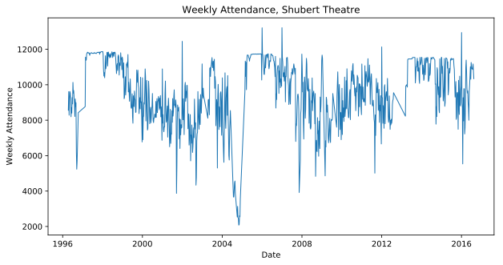
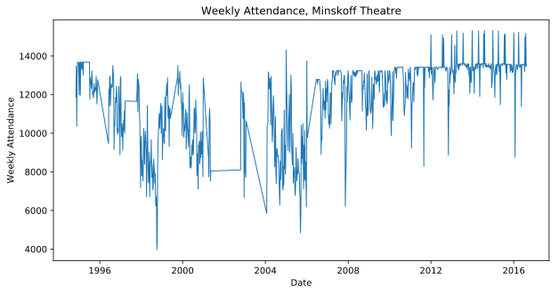
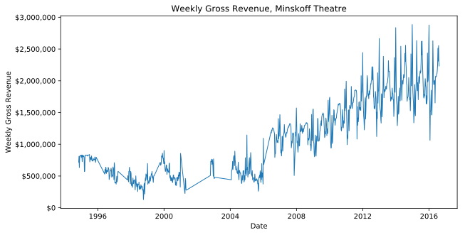
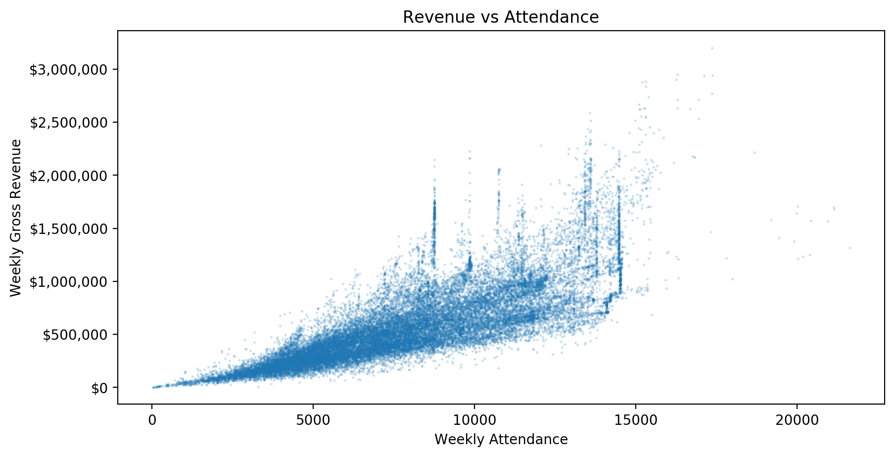
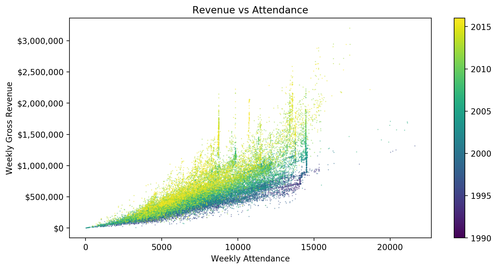
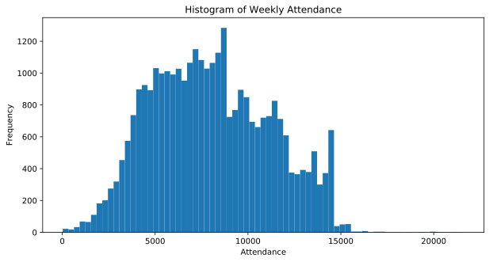

.. index:: charts

Charts
------

When you are dealing with a very small number of data points, its often easy to simply look and know something about what you've got. Let's say you were playing a card game and you had five cards in your hand. Without too much effort you could look at your hand and tell me the most common suit. However, the more data you have the harder it gets to just look and then draw some kind of reasonable conclusion. Let's say you could hold fifty cards in your hand. You would probably have to count them all to figure out the most common suit. Or rather than counting them, you could sort them into nice stacks and see which is the biggest. Fifty cards sorted into four nice stacks is a kind of summary of the data that may hide some of the detail, but helps you answer the question you are interested in. Good visualizations work the same way. 

Visualizations are visual representations of data that are designed to make it easier to understand something about that data. They are a type of abstract representation and if they are done well they can be very powerful. However, it is also easy to do them poorly and to make something that is confusing or potentially misleading. Good visualizations should be clear and honest. 

There are many many different types of visualizations with different strengths and weaknesses. Choosing the right visualization for your question can be challenging, so for now we are going to keep it simple and just talk about some key types of visualizations.  

Chart Terminology
~~~~~~~~~~~~~~~~~

A **chart** is a fairly common type of data visualization. Charts are often
2-dimensional figures with a horizontal **x-axis** and a vertical **y-axis**.
Data is represented on these two axes using graphical elements such as lines,
bars, or individual markers. The x and y axes are typically labeled and marked
with tick marks to help you understand what the axis is representing. 

Bar Charts
~~~~~~~~~~

Bar charts are good at representing differences between types of things. They typically plot different types of things (categories) along one axis and quantitative (numeric) variables along the other. For example, a bar chart of my typical cookie consumption for the week might list types of cookies on the x-axis (categories: chocolate chip, oatmeal, sugar cookie) and then represent the number of each kind of cookie I ate (quantitative data) as bars of different heights.  The height of each bar would represent the quantity of cookies consumed as indicated on the y-axis.

It is important to realize that meanings of the bars can be very different. Those bars could represent the total number of calories in the cookies or my average mood following cookie consumption, instead of just number eaten. This is one reason that labeling your axis is important.

.. important::

   Charts should be **self-sufficient**: They should include labeling and
   titles that are sufficient for understanding the data shown in the chart.  A
   reader should not have to look anywhere else for an explanation of what each
   plotted item is supposed to mean.

Here's a more serious bar chart. Let's look at it and see what it is trying to communicate.

This chart is self-sufficient; we can see that we are comparing total revenue
for three different types of "shows."  We don't have the context to tell us
what shows are counted here, but we *can* determine that musicals have a total
revenue of about $16 billion, plays $3 billion, and "special" shows somewhere
less than $1 billion.  We know what each bar represents and what its value is.

This data, and the data in all following charts, is from a set of data about
Broadway shows from 1994 through 2016 [`source <https://think.cs.vt.edu/corgis/csv/broadway/broadway.html>`_ - part of the `CORGIS Dataset Project <https://think.cs.vt.edu/corgis/csv/index.html>`_].  With that context, we can see that across all Broadway shows, musicals make far more revenue than plays or other shows.

The meaning of the bars changes based on the labels.  If we were interested in average weekly revenue (as opposed to total revenue over time), we would generate a chart like this:

The chart looks very similar, but now the y-axis label and chart title tell us
it is representing a different view of the data.

Line Charts
~~~~~~~~~~~

Line charts often plot something continuous (like time) on the x-axis with something quantitative on the y-axis. We could plot overall cookie consumption as a function of days of the week. The x-axis would be used to represent days sequentially. The y-axis would be used to indicate the total number of cookies eaten each day. Perhaps we'd find cookie consumption is highest on Monday and lowest on Fridays.  You should note here that you could use a bar chart for this instead, with each day being treated as its own category. That would make an okay chart, but using a line to link each day might do a better job at communicating trends over time. 

Here's a more serious line chart. Let's look at it and see what it is trying to communicate...

Again, the chart is self-sufficient.  We can see that it is plotting weekly
attendance at the Shubert Theatre over time from 1994 to 2016.  Each point on
the line represents the total attendance (the point's y coordinate) of one week
(the point's x coordinate).

There are over 1,000 numbers represented in this chart.  Imagine trying to
learn anything about the data by looking at the list of 1,000 numbers.  But in
the chart, we can easily see trends, anomalies, and patterns.  For example, in
late 2004, attendance was low at this particular theater.  But in 2005, it
shoots up to a high point, staying level there for many weeks before slowly
falling again.  What might that mean?

In 2003, the Shubert Theatre was home for a `Broadway revival of the musical
Gypsy <https://en.wikipedia.org/wiki/Gypsy_(musical)#2003_Broadway_revival>`_.
That show closed in May, 2004, and it was followed by *Forever Tango '04*.
From the chart, we can see this was not nearly so popular.  And then in early
2005, the Shubert Theatre opened `Monty Python's Spamalot
<https://en.wikipedia.org/wiki/Spamalot>`_.  The flat line of attendance
numbers at that time suggests it was sold out (consistently hitting the
theater's maximum capacity) for many weeks.

We can see a similar pattern in another chart:

Here, we see the Minskoff Theatre hit a high attendance level in late 2006 and stayed there, fairly consistently, for years.  In this case, `The Lion King <https://en.wikipedia.org/wiki/The_Lion_King_(musical)>`_ moved to the Minskoff Theatre in 2006.  From Wikipedia: "It is Broadway's third longest-running show in history, and has grossed more than $1 billion, making it the highest grossing Broadway production of all time."  Charting the revenue of that theater over time tells us a little more:

Even with attendance relatively flat for ten years, the revenue steadily
increased.  Clearly ticket prices were increasing, no doubt thanks to the
ongoing success of the show.

Again, notice how we can see all of these patterns and trends at a glance.
Data visualization can be a very powerful, effective tool.

Scatterplots
~~~~~~~~~~~~

Scatter plots are often used to help us understand how two different things may be related. For example, let's say we were interested in if my cookie consumption was in some way related to my coffee consumption. To examine this question we might track my cookie and coffee consumption for thirty days and then make a scatterplot with number of cookies consumed represented on the x-axis and number of cups of coffee represented on the y-axis. In this case each day would be represented as a dot or marker somewhere on the chart. If my cookie and coffee consumption are somehow related the scatterplot might take some kind of shape, otherwise it might look fairly random and a bit like a cloud. 

Here's a more serious scatterplot. Let's look at it and see what it is trying to communicate...

The x-axis here represents weekly attendance, while the y-axis is weekly revenue.  We can see a clear relationship between the two, as higher attendance correlates (tends to occur with) higher revenue.  This makes sense, as each attendee will pay for their ticket, and so more attendees will result in more revenue.

But from the chart, we can see both what the relationship between attendance
and revenue is (it looks like most attendees paid between $50 and $100,
roughly) and the ranges of these values.  For example, with a weekly attendance
of 10,000 people, a theater's revenue has ranged from roughly $300,000 to above
$2,000,000!  Ticket prices clearly vary considerably.

To communicate even more about some data, we can sometimes add a *third*
dimension to a chart.  For example, color:

Here, each marker in the chart is colored based on the year of the datapoint it
represents.  Now we can see that ticket prices have varied considerably, but
they have tended to increase substantially over time.  For the same attendance
levels, weekly revenue was much higher in the 2010s than in the 1990s.

Histograms
~~~~~~~~~~

Histograms look a lot like bar charts, but they are used to tell us something a bit more specific. Histograms are used to tell us the frequency at which something occurred in our data. Going back to cookies one last time, we might ask in a month of cookie eating how many days did I eat exactly five cookies? How many days did I eat zero cookies? In a histogram of cookie consumption the x-axis would represent the number of cookies consumed; the y-axis would represent the number of times that specific value occurred. I honestly don't eat all that many cookies, so in a thirty day period the most common number of cookies consumed would be zero. The next most common would probably be two, because who eats just one cookie? So if we looked at the bars in a histogram what we are seeing is the frequency (or count) of the number of times something occurs in our data.   

There is an additional complication to making histograms. When we make the chart we have to decide how many 'bins' to create along the x-axis. In the example above it might make sense to have each number represented by a single bin. This is the simplest kind of binning but its often not possible to do use the x-axis in this way. Let's say we wanted to make a histogram representing average monthly income for people from all around the world. It would not be possible to represent every value on the x-axis in a practical way - our chart would likely be  too long to be displayed. Instead we would make a decision about grouping certain ranges of incomes together. The histograms would then represent the frequency of data points that we placed into these 'bins'. How we choose to bin can have a significant impact on what the histogram looks like, and what conclusion we might come to about the data, so you will need to be careful and thoughtful about how you selected bins.   

Here's a more serious histogram. Let's look at it and see what it is trying to communicate...

This histogram shows us the frequency of different weekly attendance values in the data set.  We can see there are some smaller counts, below 5,000 attendees per week; the most common values are between 5,000 and 10,000; nearly all attendance numbers are less than 15,000; and there are just a tiny few weeks that counted attendance at one theater around 20,000 people.

Choosing a Chart Type
~~~~~~~~~~~~~~~~~~~~~

The following table summarizes what each chart type above is best used for and
what the x- and y-axis of that type typically represents.  Always think
carefully about what type of chart will best represent the data you have and
answer the question(s) you are asking.

+--------------+---------------+------------------------+--------------+
| Chart Type   | Use to Show   | X-axis                 | Y-axis       |
+==============+===============+========================+==============+
| Bar Chart    | Comparison    | Categorical            | Quantitative |
+--------------+---------------+------------------------+--------------+
| Line Chart   | Trend, Change | Quantitative (ordered) | Quantitative |
+--------------+---------------+------------------------+--------------+
| Scatter Plot | Relationship  | Quantitative           | Quantitative |
+--------------+---------------+------------------------+--------------+
| Histogram    | Frequencies   | Quantitative           | Frequency    |
+--------------+---------------+------------------------+--------------+

.. admonition:: Check your understanding

   For each of the following scenarios, which chart type is most appropriate?

   .. mchoice:: cyu_charts01
      :answer_a: Bar chart
      :answer_b: Line chart
      :answer_c: Scatter plot
      :answer_d: Histogram
      :correct: b
      :feedback_a: Incorrect.  A bar chart does not work well for dozens of data points (each month's sales) across multiple series (each product).  Bars also do not convey changes over time well.
      :feedback_b: Correct!  With regular datapoints over time, a line chart is a good one to use, and it can easily contain multiple lines to represent the different products.
      :feedback_c: Incorrect.  A scatter plot can represent this data, but it is not the most natural choice when changes over time are of interest, because each data point is presented disconnected from all others in a scatter plot.
      :feedback_d: Incorrect.  This analysis is not looking at frequencies or counts of different values in the data, which is what histograms are made for.

      You have monthly sales data for a variety of products over several years, and you want to compare how the products sell relative to each other in different seasons.

   .. mchoice:: cyu_charts02
      :answer_a: Bar chart
      :answer_b: Line chart
      :answer_c: Scatter plot
      :answer_d: Histogram
      :correct: d
      :feedback_a: Incorrect.  The given data is just a list of ages; it doesn't contain counts for each age to be plotted.
      :feedback_b: Incorrect.  There is no sequential, increasing value (like time) against which you want to plot any values in this case.
      :feedback_c: Incorrect.  The data do not contain two series of numerical values that could be compared.
      :feedback_d: Correct!  Histograms are made for looking at frequencies or counts of different values in data.  The histogram takes numerical data, groups it into bins, and calculates numerical counts to be plotted.

      You have a list of character ages for all novels written in a particular time period, and you want to see how common each age (or range of ages, say 20-25) is across all of those novels.

   .. mchoice:: cyu_charts03
      :answer_a: Bar chart
      :answer_b: Line chart
      :answer_c: Scatter plot
      :answer_d: Histogram
      :correct: c
      :feedback_a: Incorrect.  A bar chart does not work well for dozens of elements or more, especially when comparing two different values for each element.
      :feedback_b: Incorrect.  There is no sequential, increasing value (like time) against which you want to plot any values in this case.
      :feedback_c: Correct!  A scatter plot is an excellent tool for looking for correlations or other relationships between paired data.
      :feedback_d: Incorrect.  This analysis is not looking at frequencies or counts of different values in the data, which is what histograms are made for.

      You have run a biology experiment on a large number of samples, collecting two different measurements for each sample.  You are interested to see if there is any relationship or correlation between the two measurements across the collection of all samples.
