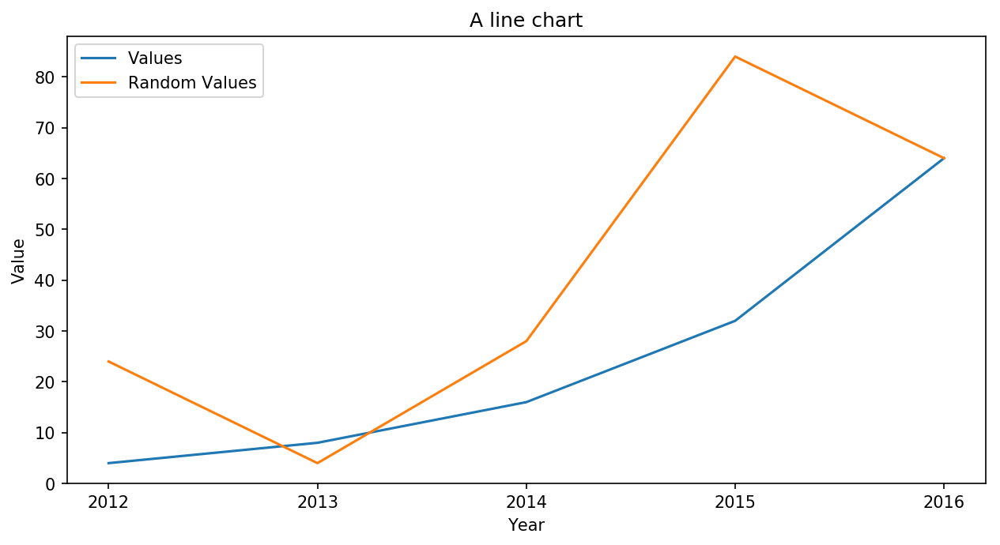
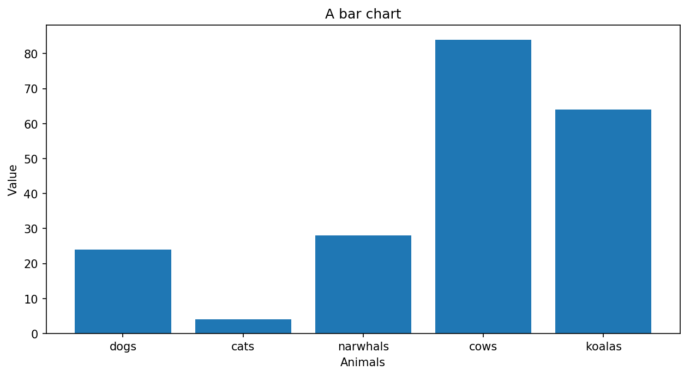
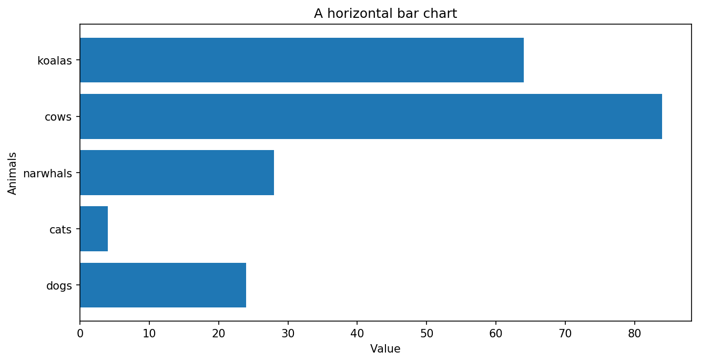
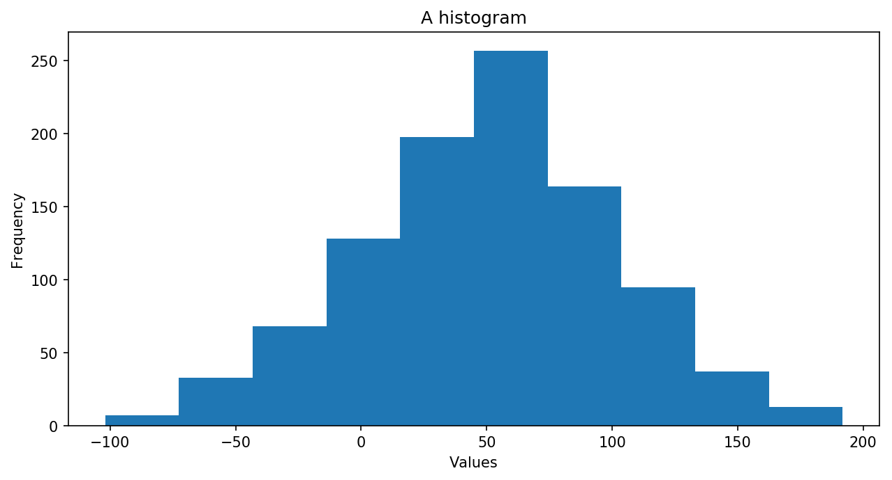
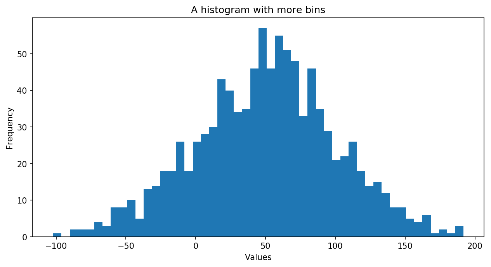
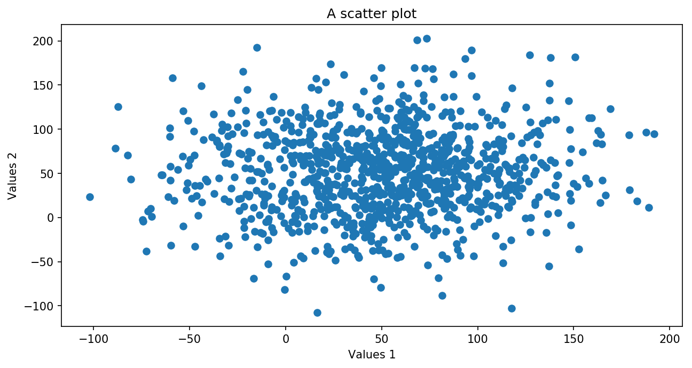
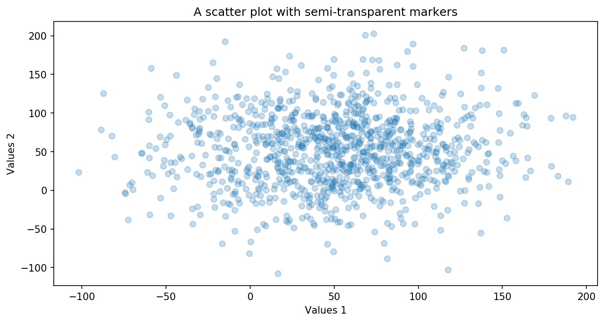

.. index:: matplotlib, chart;line, chart;bar, line chart, bar chart, scatter plot, histogram

.. note::
   This is a static copy of a Jupyter notebook.  You can access a live
   version of it, allowing you to modify and execute the code, in one of two ways:
  
   - `Jhub
     <https://jhub.iwu.edu/hub/user-redirect/git-pull?repo=https%3A%2F%2Fgithub.com%2FCS-DS-125%2F125exercises-f18&branch=master&urlPath=lab/tree/125exercises-f18/ch06/howto_matplotlib.ipynb>`_
     (for students in IWU's CS/DS course)
   - `Binder
     <https://mybinder.org/v2/gh/CS-DS-125/125exercises-f18/master?filepath=ch06%2Fhowto_matplotlib.ipynb>`_
     (for anyone else)

Creating Visualizations with Matplotlib
=======================================

Matplotlib is a “Python 2D plotting library” for creating a wide range
of data visualizations. It is very powerful, and that means it *can* get
complicated. Here, we will stick to a few specific tools it provides in
order to limit the complexity.

Importing Matplotlib
--------------------

First, some imports.

The first imports one *piece* of Matplotlib that we will use and names
it ``plt``. This is commonly done to make it faster to type (we’ll be
using it and thus typing it a lot). This will be our tool for creating
and modifying plots.

.. code:: python

    import matplotlib.pyplot as plt

We’ll also run the following line of code to make the charts look a bit
nicer than the defaults in Jupyter. Exactly how these work isn’t
terribly important, but if you like you can try changing the numbers and
regenerate plots below to see the effects.

.. code:: python

    # For slightly nicer charts
    plt.rcParams['figure.figsize'] = [10, 5]
    plt.rcParams['figure.dpi'] = 150

Then, just for generating some example data in this notebook, we import
our old friend the ``random`` module from Python’s standard library.

.. code:: python

    import random

Example data for use in charts
------------------------------

The following lists are example data for use in a few demonstration
charts.

.. code:: python

    categories = ['dogs', 'cats', 'narwhals', 'cows', 'koalas']
    
    years = ['2012', '2013', '2014', '2015', '2016']
    
    values = [4, 8, 16, 32, 64]
    
    # Randomly choose 5 values from 0 to 99:
    values_rand = random.sample(range(100), 5)
    
    # Make two lists, each with 1000 elements sampled from a
    # random gaussian distribution (aka "normal" distribution) centered on 50:
    values_rand_long = []
    values_rand_long_2 = []
    for i in range(1000):
        values_rand_long.append(random.gauss(50, 50))
        values_rand_long_2.append(random.gauss(50, 50))

Line chart
----------

First, we will use Matplotlib (via the ``plt`` name we made above when
we imported it) to make a line chart.

Note that every line in the following cell is using **dot notation** to
call a **method** in the ``plt`` **object**.

The methods used here are:

- ``plt.plot()`` - Add a “data series” (one line) to the chart, given as two arguments: a list of x values and a list of y values of the same length. Call this multiple times to add multiple data series.
- ``plt.xlabel()`` - Add a label to the x-axis.
- ``plt.ylabel()`` - Add a label to the y-axis.
- ``plt.legend()`` - Add a legend to the chart. The argument should be a list of strings, with one string for each data series to give it a label.
- ``plt.title()`` - Add a title to the chart.
- ``plt.show()`` - Show (display) the chart that has been generated at this point.

.. code:: python

    plt.plot(years, values)
    plt.plot(years, values_rand)
    plt.xlabel("Year")
    plt.ylabel("Value")
    plt.legend(["Values", "Random Values"])
    plt.title('A line chart')
    plt.show()

Bar chart
---------

Next is the bar chart. Here, we use ``plt.bar()`` instead of
``plt.plot()``, and for clarity, we have specified the names of its two
arguments, writing them as ``x=[...]`` and ``height=[...]``. You can
leave off the ``x=`` and ``height=`` parts, and it will still work, but
it often is easier to read and understand when the names are explicitly
written like this.

The methods ``plt.xlabel()``, ``plt.ylabel()``, ``plt.title()``, and
``plt.show()`` are used again here.

.. code:: python

    plt.bar(x=categories, height=values_rand)
    plt.xlabel("Animals")
    plt.ylabel("Value")
    plt.title("A bar chart")
    plt.show()

Or, we can create a *horizontal* bar chart. This might work better for
visualizing some data sets.

Note that we’ve changed ``plt.bar()`` to ``plt.barh()``, which takes
``y`` and ``width`` arguments instead of ``x`` and ``height``. We also
swapped the x- and y-axis labels.

.. code:: python

    plt.barh(y=categories, width=values_rand)
    plt.xlabel("Value")
    plt.ylabel("Animals")
    plt.title("A horizontal bar chart")
    plt.show()

Histogram
---------

Matplotlib can make a histogram from any list of numbers. We’ll use the
long list of random values generated before, ``values_rand_long``.

We use the ``plt.hist()`` method here, which can take a list of numbers
as its argument ``x``. It will automatically create “bins” and count the
number of values that fall in each bin to create the plot.

.. code:: python

    plt.hist(x=values_rand_long)
    plt.xlabel("Values")
    plt.ylabel("Frequency")
    plt.title("A histogram")
    plt.show()

We can control the number of bins using the ``bins=`` argument to the
``plt.hist()`` method:

.. code:: python

    plt.hist(x=values_rand_long, bins=50)
    plt.xlabel("Values")
    plt.ylabel("Frequency")
    plt.title("A histogram with more bins")
    plt.show()

Scatter plot
------------

To create a scatter plot, we use the ``plt.scatter()`` method and
provide lists for its ``x`` and ``y`` arguments containing the x and y
values, respectively, for each point in the chart:

.. code:: python

    plt.scatter(x=values_rand_long, y=values_rand_long_2)
    plt.xlabel("Values 1")
    plt.ylabel("Values 2")
    plt.title("A scatter plot")
    plt.show()

We might want to make the individual markers somewhat transparent to
better see what is going on in a region with a lot of overlapping
markers. The ``alpha=0.25`` argument makes each marker 25% opaque (thus
75% transparent). It can range from 0.0 (fully transparent) to 1.0
(fully opaque).

.. code:: python

    plt.scatter(x=values_rand_long, y=values_rand_long_2, alpha=0.25)
    plt.xlabel("Values 1")
    plt.ylabel("Values 2")
    plt.title("A scatter plot with semi-transparent markers")
    plt.show()

