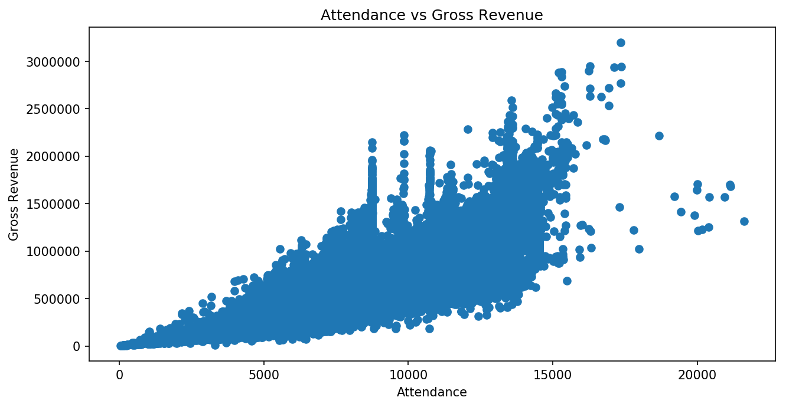

.. index:: matplotlib, pandas

.. note::
   This is a static copy of a Jupyter notebook.  You can access a live
   version of it, allowing you to modify and execute the code, in one of two ways:
  
   - `Jhub
     <https://jhub.iwu.edu/hub/user-redirect/git-pull?repo=https%3A%2F%2Fgithub.com%2FCS-DS-125%2F125exercises-f18&branch=master&urlPath=lab/tree/125exercises-f18/ch06/howto_pandas-matplotlib.ipynb>`_
     (for students in IWU's CS/DS course)
   - `Binder
     <https://mybinder.org/v2/gh/CS-DS-125/125exercises-f18/master?filepath=ch06%2Fhowto_pandas-matplotlib.ipynb>`_
     (for anyone else)

Creating Visualizations with Matplotlib and Pandas
==================================================

Matplotlib is a “Python 2D plotting library” for creating a wide range
of data visualizations. Pandas bills itself as a “Python data analysis
library.” Together, they provide a powerful toolkit for doing data
science.

Each library is very powerful, and that means they *can* get
complicated. Here, we will stick to a few specific tools each library
provides in order to limit the complexity.

Importing Matplotlib and Pandas
-------------------------------

First, some imports.

The first imports one *piece* of Matplotlib and names it ``plt``. This
is commonly done to make it faster to type (we’ll be using it and thus
typing it a lot). This will be our tool for creating and modifying
plots.

.. code:: python

    import matplotlib.pyplot as plt

The second imports pandas and names the whole library ``pd``, again a
common short name used to make code slightly shorter and faster to type.

.. code:: python

    import pandas as pd

We’ll also run the following line of code to make the charts look a bit
nicer than the defaults in Jupyter.

.. code:: python

    # For slightly nicer charts
    plt.rcParams['figure.figsize'] = [10, 5]
    plt.rcParams['figure.dpi'] = 150

Loading data with Pandas
------------------------

We’ve seen and written code for reading data from files. It’s
complicated, especially when we have to parse the data (converting
strings to numbers and other data types) and filter it (dealing with
missing or incorrect values, for example). Because this is a common
task, though, pandas provides tools that handle many common situations.

In our case, we will be reading data from ``.csv`` files (storing data
in the `Comma-separated
values <https://en.wikipedia.org/wiki/Comma-separated_values>`__
format), and pandas provides the ``pd.read_csv()`` method. We give it a
filename as an argument. Here, we’re loading data from the `Broadway
dataset <https://think.cs.vt.edu/corgis/csv/broadway/broadway.html>`__
from CORGIS. Because one of the columns is a date, we tell pandas to
parse the date (turn the strings into a data type that can represent
dates and times) by giving the ``parse_dates`` argument a list
containing that column’s name.

The ``pd.read_csv()`` method returns a **dataframe**. We’ll evaluate the
dataframe variable by itself on the last line of the cell to see what it
is.

.. code:: python

    df = pd.read_csv("broadway.csv", parse_dates=["Full"])
    df

.. raw:: html

    

    
    <table border="1" class="dataframe">
      <thead>
        <tr style="text-align: right;">
          <th></th>
          <th>Attendance</th>
          <th>Capacity</th>
          <th>Day</th>
          <th>Full</th>
          <th>Gross</th>
          <th>Gross Potential</th>
          <th>Month</th>
          <th>Name</th>
          <th>Performances</th>
          <th>Theatre</th>
          <th>Type</th>
          <th>Year</th>
        </tr>
      </thead>
      <tbody>
        <tr>
          <th>0</th>
          <td>5500</td>
          <td>88</td>
          <td>26</td>
          <td>1990-08-26</td>
          <td>134456</td>
          <td>0</td>
          <td>8</td>
          <td>Tru</td>
          <td>8</td>
          <td>Booth</td>
          <td>Play</td>
          <td>1990</td>
        </tr>
        <tr>
          <th>1</th>
          <td>1737</td>
          <td>100</td>
          <td>24</td>
          <td>1991-03-24</td>
          <td>100647</td>
          <td>0</td>
          <td>3</td>
          <td>Miss Saigon</td>
          <td>0</td>
          <td>Broadway</td>
          <td>Musical</td>
          <td>1991</td>
        </tr>
        <tr>
          <th>2</th>
          <td>12160</td>
          <td>100</td>
          <td>31</td>
          <td>1991-03-31</td>
          <td>634424</td>
          <td>0</td>
          <td>3</td>
          <td>Miss Saigon</td>
          <td>0</td>
          <td>Broadway</td>
          <td>Musical</td>
          <td>1991</td>
        </tr>
        <tr>
          <th>3</th>
          <td>13921</td>
          <td>100</td>
          <td>7</td>
          <td>1991-04-07</td>
          <td>713353</td>
          <td>0</td>
          <td>4</td>
          <td>Miss Saigon</td>
          <td>0</td>
          <td>Broadway</td>
          <td>Musical</td>
          <td>1991</td>
        </tr>
        <tr>
          <th>4</th>
          <td>10973</td>
          <td>90</td>
          <td>14</td>
          <td>1991-04-14</td>
          <td>573981</td>
          <td>0</td>
          <td>4</td>
          <td>Miss Saigon</td>
          <td>4</td>
          <td>Broadway</td>
          <td>Musical</td>
          <td>1991</td>
        </tr>
        <tr>
          <th>5</th>
          <td>14076</td>
          <td>101</td>
          <td>21</td>
          <td>1991-04-21</td>
          <td>706793</td>
          <td>0</td>
          <td>4</td>
          <td>Miss Saigon</td>
          <td>8</td>
          <td>Broadway</td>
          <td>Musical</td>
          <td>1991</td>
        </tr>
        <tr>
          <th>6</th>
          <td>14065</td>
          <td>101</td>
          <td>28</td>
          <td>1991-04-28</td>
          <td>714968</td>
          <td>0</td>
          <td>4</td>
          <td>Miss Saigon</td>
          <td>8</td>
          <td>Broadway</td>
          <td>Musical</td>
          <td>1991</td>
        </tr>
        <tr>
          <th>7</th>
          <td>14064</td>
          <td>101</td>
          <td>5</td>
          <td>1991-05-05</td>
          <td>730765</td>
          <td>0</td>
          <td>5</td>
          <td>Miss Saigon</td>
          <td>8</td>
          <td>Broadway</td>
          <td>Musical</td>
          <td>1991</td>
        </tr>
        <tr>
          <th>8</th>
          <td>13896</td>
          <td>100</td>
          <td>12</td>
          <td>1991-05-12</td>
          <td>766713</td>
          <td>0</td>
          <td>5</td>
          <td>Miss Saigon</td>
          <td>8</td>
          <td>Broadway</td>
          <td>Musical</td>
          <td>1991</td>
        </tr>
        <tr>
          <th>9</th>
          <td>13738</td>
          <td>99</td>
          <td>19</td>
          <td>1991-05-19</td>
          <td>763332</td>
          <td>0</td>
          <td>5</td>
          <td>Miss Saigon</td>
          <td>8</td>
          <td>Broadway</td>
          <td>Musical</td>
          <td>1991</td>
        </tr>
        <tr>
          <th>10</th>
          <td>13897</td>
          <td>100</td>
          <td>26</td>
          <td>1991-05-26</td>
          <td>769137</td>
          <td>0</td>
          <td>5</td>
          <td>Miss Saigon</td>
          <td>8</td>
          <td>Broadway</td>
          <td>Musical</td>
          <td>1991</td>
        </tr>
        <tr>
          <th>11</th>
          <td>14016</td>
          <td>101</td>
          <td>2</td>
          <td>1991-06-02</td>
          <td>774412</td>
          <td>0</td>
          <td>6</td>
          <td>Miss Saigon</td>
          <td>8</td>
          <td>Broadway</td>
          <td>Musical</td>
          <td>1991</td>
        </tr>
        <tr>
          <th>12</th>
          <td>14088</td>
          <td>101</td>
          <td>9</td>
          <td>1991-06-09</td>
          <td>771767</td>
          <td>0</td>
          <td>6</td>
          <td>Miss Saigon</td>
          <td>8</td>
          <td>Broadway</td>
          <td>Musical</td>
          <td>1991</td>
        </tr>
        <tr>
          <th>13</th>
          <td>14088</td>
          <td>101</td>
          <td>16</td>
          <td>1991-06-16</td>
          <td>770819</td>
          <td>0</td>
          <td>6</td>
          <td>Miss Saigon</td>
          <td>8</td>
          <td>Broadway</td>
          <td>Musical</td>
          <td>1991</td>
        </tr>
        <tr>
          <th>14</th>
          <td>14088</td>
          <td>101</td>
          <td>23</td>
          <td>1991-06-23</td>
          <td>771192</td>
          <td>0</td>
          <td>6</td>
          <td>Miss Saigon</td>
          <td>8</td>
          <td>Broadway</td>
          <td>Musical</td>
          <td>1991</td>
        </tr>
        <tr>
          <th>15</th>
          <td>14088</td>
          <td>101</td>
          <td>30</td>
          <td>1991-06-30</td>
          <td>777088</td>
          <td>0</td>
          <td>6</td>
          <td>Miss Saigon</td>
          <td>8</td>
          <td>Broadway</td>
          <td>Musical</td>
          <td>1991</td>
        </tr>
        <tr>
          <th>16</th>
          <td>14088</td>
          <td>101</td>
          <td>7</td>
          <td>1991-07-07</td>
          <td>779802</td>
          <td>0</td>
          <td>7</td>
          <td>Miss Saigon</td>
          <td>8</td>
          <td>Broadway</td>
          <td>Musical</td>
          <td>1991</td>
        </tr>
        <tr>
          <th>17</th>
          <td>14084</td>
          <td>101</td>
          <td>14</td>
          <td>1991-07-14</td>
          <td>782314</td>
          <td>0</td>
          <td>7</td>
          <td>Miss Saigon</td>
          <td>8</td>
          <td>Broadway</td>
          <td>Musical</td>
          <td>1991</td>
        </tr>
        <tr>
          <th>18</th>
          <td>14088</td>
          <td>101</td>
          <td>21</td>
          <td>1991-07-21</td>
          <td>781413</td>
          <td>0</td>
          <td>7</td>
          <td>Miss Saigon</td>
          <td>8</td>
          <td>Broadway</td>
          <td>Musical</td>
          <td>1991</td>
        </tr>
        <tr>
          <th>19</th>
          <td>14088</td>
          <td>101</td>
          <td>28</td>
          <td>1991-07-28</td>
          <td>786612</td>
          <td>0</td>
          <td>7</td>
          <td>Miss Saigon</td>
          <td>8</td>
          <td>Broadway</td>
          <td>Musical</td>
          <td>1991</td>
        </tr>
        <tr>
          <th>20</th>
          <td>14088</td>
          <td>101</td>
          <td>4</td>
          <td>1991-08-04</td>
          <td>782060</td>
          <td>0</td>
          <td>8</td>
          <td>Miss Saigon</td>
          <td>8</td>
          <td>Broadway</td>
          <td>Musical</td>
          <td>1991</td>
        </tr>
        <tr>
          <th>21</th>
          <td>14088</td>
          <td>101</td>
          <td>11</td>
          <td>1991-08-11</td>
          <td>781332</td>
          <td>0</td>
          <td>8</td>
          <td>Miss Saigon</td>
          <td>8</td>
          <td>Broadway</td>
          <td>Musical</td>
          <td>1991</td>
        </tr>
        <tr>
          <th>22</th>
          <td>14088</td>
          <td>101</td>
          <td>18</td>
          <td>1991-08-18</td>
          <td>784392</td>
          <td>0</td>
          <td>8</td>
          <td>Miss Saigon</td>
          <td>8</td>
          <td>Broadway</td>
          <td>Musical</td>
          <td>1991</td>
        </tr>
        <tr>
          <th>23</th>
          <td>14088</td>
          <td>101</td>
          <td>25</td>
          <td>1991-08-25</td>
          <td>786452</td>
          <td>0</td>
          <td>8</td>
          <td>Miss Saigon</td>
          <td>8</td>
          <td>Broadway</td>
          <td>Musical</td>
          <td>1991</td>
        </tr>
        <tr>
          <th>24</th>
          <td>14088</td>
          <td>101</td>
          <td>1</td>
          <td>1991-09-01</td>
          <td>786995</td>
          <td>0</td>
          <td>9</td>
          <td>Miss Saigon</td>
          <td>8</td>
          <td>Broadway</td>
          <td>Musical</td>
          <td>1991</td>
        </tr>
        <tr>
          <th>25</th>
          <td>14088</td>
          <td>101</td>
          <td>8</td>
          <td>1991-09-08</td>
          <td>783503</td>
          <td>0</td>
          <td>9</td>
          <td>Miss Saigon</td>
          <td>8</td>
          <td>Broadway</td>
          <td>Musical</td>
          <td>1991</td>
        </tr>
        <tr>
          <th>26</th>
          <td>14088</td>
          <td>101</td>
          <td>15</td>
          <td>1991-09-15</td>
          <td>781614</td>
          <td>0</td>
          <td>9</td>
          <td>Miss Saigon</td>
          <td>8</td>
          <td>Broadway</td>
          <td>Musical</td>
          <td>1991</td>
        </tr>
        <tr>
          <th>27</th>
          <td>14088</td>
          <td>101</td>
          <td>22</td>
          <td>1991-09-22</td>
          <td>780148</td>
          <td>0</td>
          <td>9</td>
          <td>Miss Saigon</td>
          <td>8</td>
          <td>Broadway</td>
          <td>Musical</td>
          <td>1991</td>
        </tr>
        <tr>
          <th>28</th>
          <td>14088</td>
          <td>101</td>
          <td>29</td>
          <td>1991-09-29</td>
          <td>776172</td>
          <td>0</td>
          <td>9</td>
          <td>Miss Saigon</td>
          <td>8</td>
          <td>Broadway</td>
          <td>Musical</td>
          <td>1991</td>
        </tr>
        <tr>
          <th>29</th>
          <td>14088</td>
          <td>101</td>
          <td>6</td>
          <td>1991-10-06</td>
          <td>775124</td>
          <td>0</td>
          <td>10</td>
          <td>Miss Saigon</td>
          <td>8</td>
          <td>Broadway</td>
          <td>Musical</td>
          <td>1991</td>
        </tr>
        <tr>
          <th>...</th>
          <td>...</td>
          <td>...</td>
          <td>...</td>
          <td>...</td>
          <td>...</td>
          <td>...</td>
          <td>...</td>
          <td>...</td>
          <td>...</td>
          <td>...</td>
          <td>...</td>
          <td>...</td>
        </tr>
        <tr>
          <th>31266</th>
          <td>13558</td>
          <td>100</td>
          <td>7</td>
          <td>2016-08-07</td>
          <td>2292428</td>
          <td>97</td>
          <td>8</td>
          <td>The Lion King</td>
          <td>8</td>
          <td>Minskoff</td>
          <td>Musical</td>
          <td>2016</td>
        </tr>
        <tr>
          <th>31267</th>
          <td>10475</td>
          <td>82</td>
          <td>7</td>
          <td>2016-08-07</td>
          <td>961265</td>
          <td>63</td>
          <td>8</td>
          <td>The Phantom Of The Opera</td>
          <td>8</td>
          <td>Majestic</td>
          <td>Musical</td>
          <td>2016</td>
        </tr>
        <tr>
          <th>31268</th>
          <td>8128</td>
          <td>97</td>
          <td>7</td>
          <td>2016-08-07</td>
          <td>996212</td>
          <td>98</td>
          <td>8</td>
          <td>Waitress</td>
          <td>8</td>
          <td>Brooks Atkinson</td>
          <td>Musical</td>
          <td>2016</td>
        </tr>
        <tr>
          <th>31269</th>
          <td>15295</td>
          <td>94</td>
          <td>7</td>
          <td>2016-08-07</td>
          <td>1927412</td>
          <td>96</td>
          <td>8</td>
          <td>Wicked</td>
          <td>9</td>
          <td>Gershwin</td>
          <td>Musical</td>
          <td>2016</td>
        </tr>
        <tr>
          <th>31270</th>
          <td>13288</td>
          <td>96</td>
          <td>14</td>
          <td>2016-08-14</td>
          <td>1663119</td>
          <td>90</td>
          <td>8</td>
          <td>Aladdin</td>
          <td>8</td>
          <td>New Amsterdam</td>
          <td>Musical</td>
          <td>2016</td>
        </tr>
        <tr>
          <th>31271</th>
          <td>3877</td>
          <td>64</td>
          <td>14</td>
          <td>2016-08-14</td>
          <td>314205</td>
          <td>38</td>
          <td>8</td>
          <td>An Act Of God 2016</td>
          <td>8</td>
          <td>Booth</td>
          <td>Play</td>
          <td>2016</td>
        </tr>
        <tr>
          <th>31272</th>
          <td>9111</td>
          <td>68</td>
          <td>14</td>
          <td>2016-08-14</td>
          <td>687762</td>
          <td>47</td>
          <td>8</td>
          <td>An American In Paris</td>
          <td>8</td>
          <td>Palace</td>
          <td>Musical</td>
          <td>2016</td>
        </tr>
        <tr>
          <th>31273</th>
          <td>6829</td>
          <td>83</td>
          <td>14</td>
          <td>2016-08-14</td>
          <td>728242</td>
          <td>72</td>
          <td>8</td>
          <td>Beautiful</td>
          <td>8</td>
          <td>Stephen Sondheim</td>
          <td>Musical</td>
          <td>2016</td>
        </tr>
        <tr>
          <th>31274</th>
          <td>10292</td>
          <td>94</td>
          <td>14</td>
          <td>2016-08-14</td>
          <td>1108909</td>
          <td>78</td>
          <td>8</td>
          <td>Cats 2016</td>
          <td>8</td>
          <td>Neil Simon</td>
          <td>Musical</td>
          <td>2016</td>
        </tr>
        <tr>
          <th>31275</th>
          <td>6929</td>
          <td>80</td>
          <td>14</td>
          <td>2016-08-14</td>
          <td>571623</td>
          <td>60</td>
          <td>8</td>
          <td>Chicago</td>
          <td>8</td>
          <td>Ambassador</td>
          <td>Musical</td>
          <td>2016</td>
        </tr>
        <tr>
          <th>31276</th>
          <td>8632</td>
          <td>63</td>
          <td>14</td>
          <td>2016-08-14</td>
          <td>652283</td>
          <td>42</td>
          <td>8</td>
          <td>Fiddler On The Roof 2015</td>
          <td>8</td>
          <td>Broadway</td>
          <td>Musical</td>
          <td>2016</td>
        </tr>
        <tr>
          <th>31277</th>
          <td>8775</td>
          <td>73</td>
          <td>14</td>
          <td>2016-08-14</td>
          <td>628895</td>
          <td>43</td>
          <td>8</td>
          <td>Finding Neverland</td>
          <td>8</td>
          <td>Lunt-Fontanne</td>
          <td>Musical</td>
          <td>2016</td>
        </tr>
        <tr>
          <th>31278</th>
          <td>4966</td>
          <td>84</td>
          <td>14</td>
          <td>2016-08-14</td>
          <td>379242</td>
          <td>48</td>
          <td>8</td>
          <td>Fun Home</td>
          <td>8</td>
          <td>Circle In The Square</td>
          <td>Musical</td>
          <td>2016</td>
        </tr>
        <tr>
          <th>31279</th>
          <td>10756</td>
          <td>102</td>
          <td>14</td>
          <td>2016-08-14</td>
          <td>2045095</td>
          <td>105</td>
          <td>8</td>
          <td>Hamilton</td>
          <td>8</td>
          <td>Richard Rodgers</td>
          <td>Musical</td>
          <td>2016</td>
        </tr>
        <tr>
          <th>31280</th>
          <td>5991</td>
          <td>61</td>
          <td>14</td>
          <td>2016-08-14</td>
          <td>530413</td>
          <td>46</td>
          <td>8</td>
          <td>Jersey Boys</td>
          <td>8</td>
          <td>August Wilson</td>
          <td>Musical</td>
          <td>2016</td>
        </tr>
        <tr>
          <th>31281</th>
          <td>7117</td>
          <td>62</td>
          <td>14</td>
          <td>2016-08-14</td>
          <td>651433</td>
          <td>50</td>
          <td>8</td>
          <td>Kinky Boots</td>
          <td>8</td>
          <td>Al Hirschfeld</td>
          <td>Musical</td>
          <td>2016</td>
        </tr>
        <tr>
          <th>31282</th>
          <td>11244</td>
          <td>100</td>
          <td>14</td>
          <td>2016-08-14</td>
          <td>1035397</td>
          <td>88</td>
          <td>8</td>
          <td>Les Misrables '14</td>
          <td>8</td>
          <td>Imperial</td>
          <td>Musical</td>
          <td>2016</td>
        </tr>
        <tr>
          <th>31283</th>
          <td>10341</td>
          <td>90</td>
          <td>14</td>
          <td>2016-08-14</td>
          <td>876824</td>
          <td>73</td>
          <td>8</td>
          <td>Matilda</td>
          <td>8</td>
          <td>Shubert</td>
          <td>Musical</td>
          <td>2016</td>
        </tr>
        <tr>
          <th>31284</th>
          <td>7585</td>
          <td>58</td>
          <td>14</td>
          <td>2016-08-14</td>
          <td>703403</td>
          <td>45</td>
          <td>8</td>
          <td>On Your Feet!</td>
          <td>8</td>
          <td>Marquis</td>
          <td>Musical</td>
          <td>2016</td>
        </tr>
        <tr>
          <th>31285</th>
          <td>11360</td>
          <td>75</td>
          <td>14</td>
          <td>2016-08-14</td>
          <td>997867</td>
          <td>55</td>
          <td>8</td>
          <td>Paramour</td>
          <td>8</td>
          <td>Lyric</td>
          <td>Musical</td>
          <td>2016</td>
        </tr>
        <tr>
          <th>31286</th>
          <td>11342</td>
          <td>95</td>
          <td>14</td>
          <td>2016-08-14</td>
          <td>1160694</td>
          <td>76</td>
          <td>8</td>
          <td>School Of Rock</td>
          <td>8</td>
          <td>Winter Garden</td>
          <td>Musical</td>
          <td>2016</td>
        </tr>
        <tr>
          <th>31287</th>
          <td>7239</td>
          <td>67</td>
          <td>14</td>
          <td>2016-08-14</td>
          <td>584022</td>
          <td>46</td>
          <td>8</td>
          <td>Something Rotten!</td>
          <td>8</td>
          <td>St. James</td>
          <td>Musical</td>
          <td>2016</td>
        </tr>
        <tr>
          <th>31288</th>
          <td>8731</td>
          <td>102</td>
          <td>14</td>
          <td>2016-08-14</td>
          <td>1305962</td>
          <td>97</td>
          <td>8</td>
          <td>The Book Of Mormon</td>
          <td>8</td>
          <td>Eugene O'Neill</td>
          <td>Musical</td>
          <td>2016</td>
        </tr>
        <tr>
          <th>31289</th>
          <td>7367</td>
          <td>88</td>
          <td>14</td>
          <td>2016-08-14</td>
          <td>718400</td>
          <td>70</td>
          <td>8</td>
          <td>The Color Purple 2015</td>
          <td>8</td>
          <td>Jacobs</td>
          <td>Musical</td>
          <td>2016</td>
        </tr>
        <tr>
          <th>31290</th>
          <td>6407</td>
          <td>79</td>
          <td>14</td>
          <td>2016-08-14</td>
          <td>464058</td>
          <td>54</td>
          <td>8</td>
          <td>The Curious Incident Of The Dog In The Night-Time</td>
          <td>8</td>
          <td>Ethel Barrymore</td>
          <td>Play</td>
          <td>2016</td>
        </tr>
        <tr>
          <th>31291</th>
          <td>7234</td>
          <td>87</td>
          <td>14</td>
          <td>2016-08-14</td>
          <td>603770</td>
          <td>62</td>
          <td>8</td>
          <td>The Humans</td>
          <td>8</td>
          <td>Schoenfeld</td>
          <td>Play</td>
          <td>2016</td>
        </tr>
        <tr>
          <th>31292</th>
          <td>13485</td>
          <td>99</td>
          <td>14</td>
          <td>2016-08-14</td>
          <td>2233894</td>
          <td>97</td>
          <td>8</td>
          <td>The Lion King</td>
          <td>8</td>
          <td>Minskoff</td>
          <td>Musical</td>
          <td>2016</td>
        </tr>
        <tr>
          <th>31293</th>
          <td>10966</td>
          <td>85</td>
          <td>14</td>
          <td>2016-08-14</td>
          <td>999632</td>
          <td>66</td>
          <td>8</td>
          <td>The Phantom Of The Opera</td>
          <td>8</td>
          <td>Majestic</td>
          <td>Musical</td>
          <td>2016</td>
        </tr>
        <tr>
          <th>31294</th>
          <td>8058</td>
          <td>96</td>
          <td>14</td>
          <td>2016-08-14</td>
          <td>990128</td>
          <td>97</td>
          <td>8</td>
          <td>Waitress</td>
          <td>8</td>
          <td>Brooks Atkinson</td>
          <td>Musical</td>
          <td>2016</td>
        </tr>
        <tr>
          <th>31295</th>
          <td>13804</td>
          <td>95</td>
          <td>14</td>
          <td>2016-08-14</td>
          <td>1779664</td>
          <td>100</td>
          <td>8</td>
          <td>Wicked</td>
          <td>8</td>
          <td>Gershwin</td>
          <td>Musical</td>
          <td>2016</td>
        </tr>
      </tbody>
    </table>
    
31296 rows × 12 columns

    

The dataframe (which we named ``df``) is a table with 31,296 rows and 12
columns containing all of the data from the CSV file. It has parsed out
the column names, given each row an index (counting from 0), parsed
strings into numbers in certain columns automatically, and given us a
single **object** (the ``df`` variable) that we can use to access all of
this.

Plotting data from a dataframe
------------------------------

We can use a dataframe as a source of data for Matplotlib’s plotting
functions. Instead of giving the plotting functions lists of values, we
give it the entire dataframe (as an argument ``data=[...]``) and specify
which columns we want to plot by name.

For example, to make a scatter plot with the Attendance values on the x
axis and Gross (revenue) values on the y axis, we can call
``plt.scatter()`` with ``x="Attendance"``, ``y="Gross"``, and
``data=df``.

.. code:: python

    plt.scatter(x="Attendance", y="Gross", data=df)
    plt.xlabel("Attendance")
    plt.ylabel("Gross Revenue")
    plt.title("Attendance vs Gross Revenue")
    plt.show()

This particular plot has 31 thousand markers and a lot of overlap, which
makes it difficult to see what is going on in the giant “blob” of
overlapping markers. To make a better, more useful visualization, we can
set ``alpha=0.1`` to make the markers semi-transparent and ``s=2`` to
reduce the size of each marker.

.. code:: python

    plt.scatter(x="Attendance", y="Gross", data=df, alpha=0.1, s=2)
    plt.xlabel("Attendance")
    plt.ylabel("Gross Revenue")
    plt.title("Attendance vs Gross Revenue")
    plt.show()

Histogram
---------

Again, we can specify the data we want to plot in a histogram by giving
the ``plt.hist()`` method a column label for its ``x`` argument and a
dataframe for the ``data`` argument.

.. code:: python

    plt.hist(x="Capacity", data=df)
    plt.xlabel("Capacity (percent)")
    plt.ylabel("Count")
    plt.title("Histogram of Capacity percentages")
    plt.show()

This plot looks odd. The x-axis extends to 800 and beyond, even though
it should be representing a capacity percentage that shouldn’t go much
above 100%. But there are a few rows in the data that contain odd
capacity values well above 100%. We might choose to visualize the
“normal” capacity values alone by filtering out the odd ones.

To do this, we can use the dataframe’s ``.query()`` method. This method
takes a string as an argument that it will interpret as a condition. The
method **returns a new dataframe** containing any rows for which that
condition is True. We store the return value in a new dataframe variable
(here, ``df_filtered_cap``) and use that as our data source for the
``plt.hist()`` method.

We’ve also changed the number of bins here to get a slightly more
granular breakdown of the data.

.. code:: python

    df_filtered_cap = df.query('Capacity < 200')
    plt.hist(x="Capacity", data=df_filtered_cap, bins=20)
    plt.xlabel("Capacity (percent)")
    plt.ylabel("Count")
    plt.title("Histogram of Capacity percentages")
    plt.show()

Line Chart
----------

For line charts, again we call Matplotlib’s plotting function
(``plt.plot()`` in this case), specifying column labels as arguments
(for the x and y axis) and a dataframe as a data source using the
``data`` argument.

Here, we want to compare revenue over time for *Rent* and *The Lion
King*, so we make two new dataframes each containing just the data for
one of those shows. Again, we can use the ``.query()`` dataframe method
to do this. Note how we have to specify the string value ``"Rent"`` or
``"The Lion King"`` inside the query string itself, so we use two
different types of quotation marks.

.. code:: python

    df_rent = df.query('Name == "Rent"')
    df_lionking = df.query('Name == "The Lion King"')
    plt.plot('Full', 'Gross', data=df_rent)
    plt.plot('Full', 'Gross', data=df_lionking)
    plt.xlabel("Date")
    plt.ylabel("Gross Revenue (weekly, $)")
    plt.legend(["Rent", "The Lion King"])
    plt.title("Weekly Gross Revenue")
    plt.show()

--------------

Scatter Plot
------------

We can use those same dataframes (with data from *Rent* and *The Lion
King*) to make a scatter plot investigating their revenue further..

Here, we plot attendance vs revenue for each show in one combined plot.
We’ve set ``alpha`` and ``s`` arguments for each to make individual data
points easier to see.

.. code:: python

    plt.scatter('Attendance', 'Gross', data=df_rent, alpha=0.25, s=5)
    plt.scatter('Attendance', 'Gross', data=df_lionking, alpha=0.25, s=5)
    plt.xlabel("Attendance (weekly)")
    plt.ylabel("Gross Revenue (weekly, $)")
    plt.legend(["Rent", "The Lion King"])
    plt.title("Attendance vs Revenue")
    plt.show()

--------------

Bar Chart
---------

Bar charts are often used for displaying just a few categories together
at once. A plot with 31 thousand bars is not very useful, for example.
Very often, then, we will **group** rows across a table by some
characteristic and **aggregate** data across multiple rows for each
group.

For example, we might want to see the total gross revenue for all
Broadway shows, grouped by type of show. Pandas gives us functions to do
this. We’ll show you how this works in a few steps.

First, we can call ``.groupby()`` on a dataframe, specifying a column
name as an argument. This will group all of the rows based on unique
values in that column. The “Type” column in our data has three values
(“Musical”, “Play”, and “Special”), and we’ll end up with three groups.

.. code:: python

    df_groupby_type = df.groupby("Type")
    df_groupby_type

.. parsed-literal::

    <pandas.core.groupby.groupby.DataFrameGroupBy object at 0x2b7e0ba906a0>

This gives us a ``DataFrameGroupBy`` object. We still need to do the
aggregation. Sums and averages (means) are commonly used here. We’ll
take a sum across each group.

.. code:: python

    df_groupby_type_sums = df_groupby_type.sum()
    df_groupby_type_sums

.. raw:: html

    

    
    <table border="1" class="dataframe">
      <thead>
        <tr style="text-align: right;">
          <th></th>
          <th>Attendance</th>
          <th>Capacity</th>
          <th>Day</th>
          <th>Gross</th>
          <th>Gross Potential</th>
          <th>Month</th>
          <th>Performances</th>
          <th>Year</th>
        </tr>
        <tr>
          <th>Type</th>
          <th></th>
          <th></th>
          <th></th>
          <th></th>
          <th></th>
          <th></th>
          <th></th>
          <th></th>
        </tr>
      </thead>
      <tbody>
        <tr>
          <th>Musical</th>
          <td>205909883</td>
          <td>1882287</td>
          <td>354478</td>
          <td>15792740093</td>
          <td>1488758</td>
          <td>147858</td>
          <td>170514</td>
          <td>45237842</td>
        </tr>
        <tr>
          <th>Play</th>
          <td>43056274</td>
          <td>618454</td>
          <td>132291</td>
          <td>2737985361</td>
          <td>446950</td>
          <td>53389</td>
          <td>53878</td>
          <td>16858645</td>
        </tr>
        <tr>
          <th>Special</th>
          <td>1731171</td>
          <td>26064</td>
          <td>5231</td>
          <td>123844139</td>
          <td>17289</td>
          <td>2460</td>
          <td>1716</td>
          <td>679381</td>
        </tr>
      </tbody>
    </table>
    

We get back a new dataframe with one row per Type value. Each column now
contains the *sum* of that column’s values across all of the rows that
had the matching type. For example, here we can see that there are 1716
performances in *total* across *all* “Special” shows.

We need to take one last step to make this useable for plotting a bar
chart. We need to turn the **index** (the name assigned to each row)
back into a **data column**. We use the ``.reset_index()`` method for
that:

.. code:: python

    df_groupby_type_sums = df_groupby_type_sums.reset_index()
    df_groupby_type_sums

.. raw:: html

    

    
    <table border="1" class="dataframe">
      <thead>
        <tr style="text-align: right;">
          <th></th>
          <th>Type</th>
          <th>Attendance</th>
          <th>Capacity</th>
          <th>Day</th>
          <th>Gross</th>
          <th>Gross Potential</th>
          <th>Month</th>
          <th>Performances</th>
          <th>Year</th>
        </tr>
      </thead>
      <tbody>
        <tr>
          <th>0</th>
          <td>Musical</td>
          <td>205909883</td>
          <td>1882287</td>
          <td>354478</td>
          <td>15792740093</td>
          <td>1488758</td>
          <td>147858</td>
          <td>170514</td>
          <td>45237842</td>
        </tr>
        <tr>
          <th>1</th>
          <td>Play</td>
          <td>43056274</td>
          <td>618454</td>
          <td>132291</td>
          <td>2737985361</td>
          <td>446950</td>
          <td>53389</td>
          <td>53878</td>
          <td>16858645</td>
        </tr>
        <tr>
          <th>2</th>
          <td>Special</td>
          <td>1731171</td>
          <td>26064</td>
          <td>5231</td>
          <td>123844139</td>
          <td>17289</td>
          <td>2460</td>
          <td>1716</td>
          <td>679381</td>
        </tr>
      </tbody>
    </table>
    

Notice how we now have a “Type” column, and each row is just given a
number index now? This will let us use the “Type” data on one of our
plot axes.

Finally, we can simplify all of the above steps into one line. Because
each of the methods we called returns a new object, we can **chain** the
method calls like this:

.. code:: python

    df_groupby_type_sums = df.groupby("Type").sum().reset_index()
    df_groupby_type_sums

.. raw:: html

    

    
    <table border="1" class="dataframe">
      <thead>
        <tr style="text-align: right;">
          <th></th>
          <th>Type</th>
          <th>Attendance</th>
          <th>Capacity</th>
          <th>Day</th>
          <th>Gross</th>
          <th>Gross Potential</th>
          <th>Month</th>
          <th>Performances</th>
          <th>Year</th>
        </tr>
      </thead>
      <tbody>
        <tr>
          <th>0</th>
          <td>Musical</td>
          <td>205909883</td>
          <td>1882287</td>
          <td>354478</td>
          <td>15792740093</td>
          <td>1488758</td>
          <td>147858</td>
          <td>170514</td>
          <td>45237842</td>
        </tr>
        <tr>
          <th>1</th>
          <td>Play</td>
          <td>43056274</td>
          <td>618454</td>
          <td>132291</td>
          <td>2737985361</td>
          <td>446950</td>
          <td>53389</td>
          <td>53878</td>
          <td>16858645</td>
        </tr>
        <tr>
          <th>2</th>
          <td>Special</td>
          <td>1731171</td>
          <td>26064</td>
          <td>5231</td>
          <td>123844139</td>
          <td>17289</td>
          <td>2460</td>
          <td>1716</td>
          <td>679381</td>
        </tr>
      </tbody>
    </table>
    

You can either call each one separately like we did at first or chain
them all together at once like this. Either way works, but chaining is
usually the preferred way to call all of these methods in order.

Now we can plot the grouped, summed data in a bar chart:

.. code:: python

    plt.bar(x="Type", height='Gross', data=df_groupby_type_sums)
    plt.ylabel("Total Gross Revenue ($)")
    plt.title("Gross Revenue by Show Type")
    plt.show()

