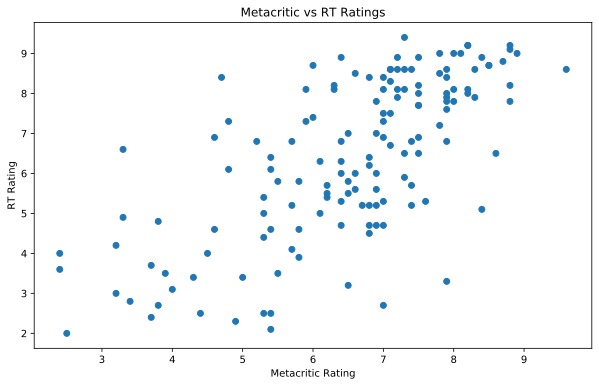

.. index:: pandas, continuous data
.. index:: dataframe;.corr(), seaborn;.heatmap(), seaborn;.pairplot(), dataframe;.unique()

.. note::
   This is a static copy of a Jupyter notebook.  You can access a live
   version of it, allowing you to modify and execute the code, in one of two ways:
  
   - `Jhub
     <https://jhub.iwu.edu/hub/user-redirect/git-pull?repo=https%3A%2F%2Fgithub.com%2FCS-DS-125%2F125exercises-f18&branch=master&urlPath=lab/tree/125exercises-f18/ch07/pandas-continuous.ipynb>`_
     (for students in IWU's CS/DS course)
   - `Binder
     <https://mybinder.org/v2/gh/CS-DS-125/125exercises-f18/master?filepath=ch07%2Fpandas-continuous.ipynb>`_
     (for anyone else)

.. include:: pandas-continuous.inc

