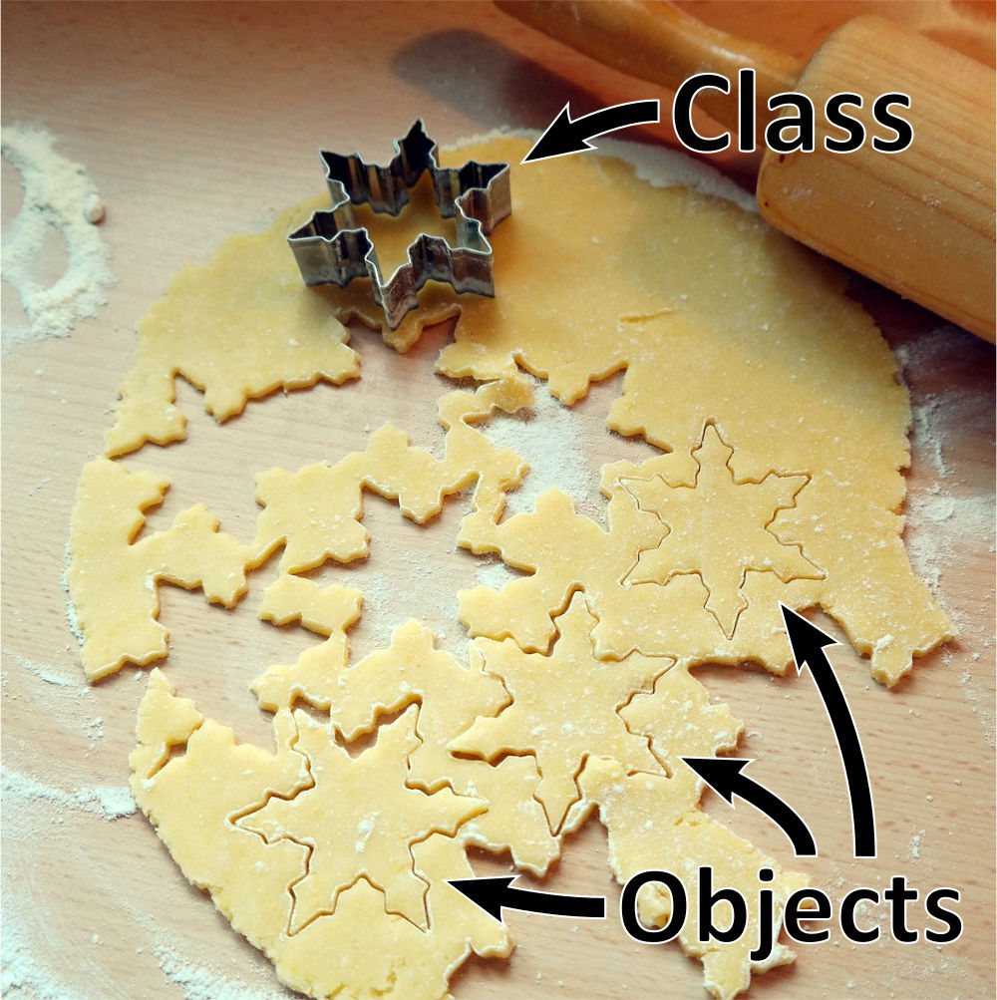

.. index:: class, instance

Classes
=======

The objects we've seen and used thus far have all had specific *types*, and
any given object type has a consistent definition across all objects of that
type.  Every DataFrame contains the same set of methods and attributes, every
String object works the same way, and every File object can be used just like
any other.  The consistent set of functionality within an object of a given
type must be defined somewhere.  That's where classes come in.

A **class** defines a type of object.  It specifies what attributes any object
of that type will have and what methods it will have.  A common analogy is to
think of classes like cookie cutters and objects like cookies made from them.
Each cookie cutter defines the shape of a particular kind of cookie, and it can
be used to make one cookie or many cookies with that shape.

   Cookie cutter and cookies

We often call each object created from a given class an **instance** of that
class, sometimes referring to the variables that hold those objects as "instance
variables."  For example, if ``df`` is a DataFrame object, we could also say that
``df`` is an instance of the DataFrame class.

Defining a Class
----------------

As with everything else in Python, the definition of a class must follow a
particular syntax:

.. admonition:: Syntax Pattern

   A class definition has the form:

   ::

      class <class name>:
          <body>

   By convention, class names are typically capitalized.  This helps us
   differentiate class names from variable and function names, which are typically
   not capitalized.

   The ``<body>`` can contain one or more **method definitions**:

   ::
  
      def <method name>(self, <optionally more parameters>):
          <body> 

   A method definition is like any other function definition, but every
   method must have at least one parameter, and that first parameter is
   conventionally named ``self``.  [This isn't an absolute rule, but it will
   always be followed as far as we are concerned in this book.]

Let's look at an example.  Try running the following with CodeLens.  It won't
print anything out, but it will create the class.

.. activecode:: classes_01

   class Box:
       def __init__(self, width, height):
           self.w = width
           self.h = height
      
       def draw(self):
           print("+" * self.w)
           for i in range(self.h - 2):
               print('|' + ' ' * (self.w - 2) + '|')
           print("+" * self.w)   

This defines a class named ``Box`` (capitalized, as noted above) with two
methods: ``__init__()`` and ``draw()``.  Notice that both method definitions
are indented inside the class.  This puts them inside the body of the class
definition.  If one were not indented, it would just be a normal function
definition, no longer part of the class.  (Try editing the code to remove
the indentation of ``draw`` and see what changes when you re-run it.)

When this code is executed, it creates the class, but none of the instructions
in its methods are executed (try it!).  Class definitions are similar to function
definitions in this way; executing a function definition creates the function,
but it doesn't run the function's body until it is called.

.. index:: instantiate, constructor, __init__()

Instantiating a Class
---------------------

To create an object from a class, we call its **constructor** function.  The
constructor is a function with the *same name* as the class that is created
implicitly when we define the class (that is, you do not have to define a
function with the same name as the class yourself).  The constructor *returns*
a new object of the class's type that can then be stored in a variable or
otherwise used in an expression.  This is also called **instantiating** the
class, because we are creating an instance of it.

.. activecode:: classes_02

   class Box:
       def __init__(self, width, height):
           self.w = width
           self.h = height
      
       def draw(self):
           print("+" * self.w)
           for i in range(self.h - 2):
               print('|' + ' ' * (self.w - 2) + '|')
           print("+" * self.w)   

   # Instantiate a Box object
   a = Box(6, 4)

   # Call a method in the new Box object
   a.draw()

The above code is best explored using the CodeLens tool.  Upon executing the
first line, the class definition is created (you can see that it contains the
two methods defined in it).  The next line, ``a = Box(6, 4)``, is calling the
constructor for the class, a function with the class's name.  Upon executing
this line, you can see that the flow of execution jumps into the ``__init__()``
method.

.. admonition:: The ``__init__()`` method

   When a class is instantiated in Python, the interpreter will automatically
   look for and call a method named ``__init__()`` in the class, if one exists.
   The name itself is thus special; if the method is named anything else, it
   will no longer be called automatically in that situation.

The goal of the ``__init__()`` method is to *initialize* the newly-created
object's *attributes* (the data stored inside the object).  Attributes are
created and assigned using dot notation with the ``self`` parameter.

.. admonition:: The ``self`` parameter

   The first parameter of a class method, typically named ``self``, is
   automatically assigned a reference to *the particular object in which a
   method is running*.  This gives the method access to the attributes and
   methods of that object.

   If the first parameter of the method is not named ``self``, it will still be
   automatically assigned a reference to the same object.  We almost always
   call it ``self`` because it is descriptive of what the variable references,
   and the convention makes it easier to read and understand code.

Watch in CodeLens as ``__init__()`` is called.  The method is defined with
three parameters, ``self``, ``width``, and ``height``, but it is called with
just two arguments, ``6`` and ``4``.  The first argument, ``self`` is
automatically assigned a reference to a new ``Box`` instance, while ``width``
and ``height`` get the two arguments from the function call.

With ``self`` referring to a new ``Box`` instance, ``self.w`` and ``self.h`` are then
two attributes, named ``w`` and ``h``, of that instance.  The two assignments
in the ``__init__()`` method create them and give them values.

.. note::

   This is a common pattern for ``__init__()`` methods in classes.  Often, you
   want to be able to give initial values to an object's attributes when you
   create the object.  Each attribute you want to initialize in this way can be
   given a parameter in the ``__init__()`` method, and then the method can
   create attributes and assign them values given to the constructor as
   arugments.  For example:

   .. code:: python

      class Example:
          def __init__(self, param1, param2, param3):
              self.attr1 = param1
              self.attr2 = param2
              self.attr3 = param3

      new_object = Example(123, "Hello", 0.5)

When ``__init__()`` returns, you can see that the newly-created ``Box`` object,
the return value of the constructor, is then assigned to the variable ``a``.

Finally, the code calls ``a.draw()``, and the flow of execution moves into the
``draw()`` method.  Again, the first parameter, ``self``, is assigned a
reference to the object in which the method is being called.  Inside the method,
using dot notation with the ``self`` parameter allows it to access the object's
attributes, in this case using them to control the width and height of a
printed box.

One Method, Multiple Instances
------------------------------

To reinforce the idea that ``self`` will always be a reference to the
particular object in which a method is being called, look at the following code
in CodeLens.

.. activecode:: classes_03

   class Box:
       def __init__(self, width, height):
           self.w = width
           self.h = height
      
       def draw(self):
           print("+" * self.w)
           for i in range(self.h - 2):
               print('|' + ' ' * (self.w - 2) + '|')
           print("+" * self.w)   

   # Instantiate three new Box objects
   a = Box(6, 4)
   b = Box(3, 3)
   c = Box(8, 2)

   # Call methods in the different objects
   a.draw()
   b.draw()
   c.draw()
   a.draw()

Each time ``__init__()`` is called, its ``self`` parameter is referencing a
new object.  And each time ``draw()`` is called, its ``self`` parameter
references just the particular object in which ``draw()`` was called.  Another
way of thinking about it is that for a method called via dot notation, ``self``
will be a reference to the object on the left side of the dot.

Fruitful Methods and Void Methods
---------------------------------

In the chapter on Functions, we discussed two types of functions in
:ref:`fruitful_vs_void`.  The same distinction can be applied to a class's
methods as well.  The ``draw()`` method above is a *void* method, because it
doesn't return a value.  We can define fruitful methods that return values as
well.  For example:

.. activecode:: classes_04

   class Box:
       def __init__(self, width, height):
           self.w = width
           self.h = height
      
       def draw(self):
           print("+" * self.w)
           for i in range(self.h - 2):
               print('|' + ' ' * (self.w - 2) + '|')
           print("+" * self.w)   

       def get_area(self):
           area = self.w * self.h
           return area

   a = Box(6, 4)

   # Call a fruitful method, and save its return value
   box_area = a.get_area()
   print(box_area)

Here, the ``get_area()`` method is a fruitful method with a return statement.
When it is called, the method returns a value, which here we save in a new
variable.

.. note::

   It can be helpful to think of void methods as things an object can **do**,
   and when you call a void method, you are telling an object to do that thing.
   Fruitful methods, on the other hand, can be thought of as answering a
   **question**, and when you call a fruitful method, you are asking the object
   that question in order to get its answer (the return value of the method).

   This can help when designing classes as well.  As you design a class and
   define its methods, think about whether each method is something you want an
   object of that type to do (implies it should be a void method) or a question
   the rest of the program might need to ask that object (suggests a fruitful
   method with a return value).

