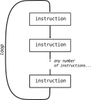

.. index:: loop, for loop, iteration
   single: loop; for

For Loops
---------

We've seen a few example programs so far that operate on multiple pieces of
data in order and/or repeat some sequence of instructions repeatedly.  This
type of flow is called a **loop**, because the program loops back around to
repeat instructions it just completed.  We call each time we execute the body
of a loop an **iteration**.

   A visual representation of a loop.

Often, especially when dealing with large amounts of data, we want to loop
through a *set* of things such as a list of words, the lines in a file, or a
list of numbers.  Lists will be covered in detail in a later chapter, but for
now, it's enough to know that we can create a list of values by writing
multiple values separated by commas between ``[`` and ``]`` symbols:

.. activecode:: forloop_listdef

   friends = ['Aisha', 'Beto', 'Carl', 'Donna']
   print(friends)
   print(type(friends))

When we have a list of things to loop through, we can construct a **for loop**
using a ``for`` statement.  A for loop starts with a for statement and includes
one or more indented lines below it that make up the **loop body**.  For
example:

.. activecode:: forloop01

   friends = ['Aisha', 'Beto', 'Carl', 'Donna']
   for friend in friends:
       print('Happy New Year:', friend)
   print('Done!')

In Python terms, the variable ``friends`` is a *list* of four strings, and the
``for`` loop goes through the list and executes the body once for each of the
four strings in the list.  The loop can be read like this: "*For* each value in
``friends``, put that value into the variable ``friend`` and run the statements
in the body of the for loop once."

Looking at the ``for`` loop, ``for`` and ``in`` are reserved Python keywords,
and ``friend`` and ``friends`` are variables.  In particular, ``friend`` is the
**loop variable** or **iteration variable** for the for loop.  The variable
``friend`` changes for each iteration of the loop and controls when the ``for``
loop completes. The loop variable successively gets each of the strings stored
in the ``friends`` variable in order.

.. admonition:: Syntax Pattern

   For loops have the form:

   ::

      for <var> in <sequence>:
          <body>

   Python interprets this as follows:

   1. Check to see if any values remain in ``<sequence>``.  If not, the loop
      ends.  Otherwise:
   2. Take the next value in ``<sequence>`` and assign it to ``<var>``.
   3. Execute the statements in ``<body>``.
   4. Repeat (go back to step 1).

   There are a few important rules to keep in mind:

   1. ``<var>`` is the loop variable, and it can be any valid variable name.
      It is created and assigned values by the loop itself.
   2. ``<sequence>`` is any sequence of values.  For now, lists are the one
      type of sequence we've seen, but there will be others.
   3. The ``<body>`` is one or more Python statements, all indented below the
      ``for`` statement.  They all have to be indented by the same amount.
      Usually we use 4 spaces to indent each line.
   4. Don't forget the colon ``:`` at the end of the for statement!  It is
      required for the loop to be valid Python syntax.

Remember, *all* for loops follow the same rules.  If you ever encounter a new for loop that doesn't look quite like one you've seen before, you can still just apply those rules to interpret the loop, step-by-step, to figure out what it does.  In a sense, you can **think like the computer**, applying the exact same rules it does when interpreting the code, to figure out what code does.

You might find the following flowchart helpful when thinking about for loops.  This shows all of the steps and decisions that Python makes when interpreting a for loop.

   Flowchart illustrating the execution of a for loop.

.. admonition:: Check your understanding

   .. fillintheblank:: cyu_forloops01

      Fill in the blanks based on how the following code executes.

      .. code:: python

         values = [10, 5, 9, 23, 7, 2]
         for val in values:
             print(val)
             print(val * 10)

      The loop will iterate |blank| times.

      The first value the code prints is |blank|.

      The second value the code prints is |blank|.

      The last value the code prints is |blank|.

      -   :6: Correct.  The loop iterates once for each value in the given sequence.
          :12: You're on the right track, but one iteration is one complete execution of the body.
          :x: Incorrect.  Think about what controls how many times a loop repeats.
      -   :10: Correct.
          :x: Incorrect.  Think through the for loop step-by-step using the rules given above.
      -   :100: Correct.
          :x: Incorrect.  Think through the for loop step-by-step using the rules given above.
      -   :20: Correct.
          :x: Incorrect.  Think through the for loop step-by-step using the rules given above.

   In the ActiveCode below, write code using a for loop to print each of the
   words in the list provided on a line by itself.

   .. activecode:: cyu_forloops02

      words = ['cat', 'orange', 'origami', 'python']
      # Your code here.

   In the ActiveCode below, write code using a for loop to print the *length*
   of each of the strings in the list provided.  (Remember the ``len()``
   function.)

   .. activecode:: cyu_forloops03

      words = ['cat', 'orange', 'origami', 'python']
      # Your code here.

      # Should print out the numbers 3, 6, 7, and 6.

